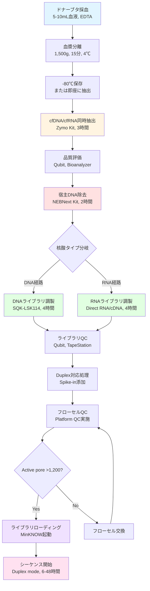

# MinION用ドナーブタ血漿病原体メタゲノム解析プロトコル
## PMDA指定91病原体スクリーニング完全マニュアル

**作成日**: 2025年10月8日
**バージョン**: 1.0
**対象**: 異種移植用ドナーブタ（Yucatan miniature pig, 3KO-7TG-59PERV）
**規制基準**: PMDA異種移植指針、厚労省別添2
**プラットフォーム**: Oxford Nanopore MinION Mk1D

----

## マスタードキュメント構成

本プロトコルは、PMDA指定91種類の病原体（ウイルス41種、細菌27種、真菌2種、原虫・寄生虫19種、特別管理微生物含む）を包括的に検出するための、MinIONシーケンシングまでの完全な実験手順を提供します。

### 💡 推奨プロトコル（2025年11月更新）

**初めて本プロトコルを使用される方へ**: 最も簡素化され効率的な **Protocol 12「統合サンプル調製プロトコル」** から開始することを強く推奨します。

- ✅ **全91病原体対応** （100%カバレッジ）
- ✅ **2つのワークフローのみ** （DNA + RNA）
- ✅ **実験時間13時間** （従来16時間から19%短縮）
- ✅ **コスト¥157,000/サンプル** （+¥5,000のみ）
- ✅ **LOD 100-500 copies/mL** （スクリーニングに十分な感度）

**Protocol 11は高感度化オプション**: LOD <50 copies/mLが必要な場合のみ参照してください。

### 文書一覧

| 章番号 | ファイル名 | 内容 | 推定時間 |
|-------|-----------|------|---------|
| 00 | `MinION_Protocol_00_目次とマスタードキュメント.md` | 本文書（全体概要） | - |
| 01 | `MinION_Protocol_01_プロトコル概要と91病原体対応戦略.md` | 技術的背景、病原体分類、戦略 | 読解30分 |
| 02 | `MinION_Protocol_02_サンプル採取・保存プロトコル.md` | 採血、血漿分離、保存手順 | 実験1時間 |
| 03 | `MinION_Protocol_03_cfDNA-cfRNA同時抽出プロトコル.md` | Zymo Kit詳細手順 | 実験3時間 |
| 04 | `MinION_Protocol_04_宿主DNA-RNA除去プロトコル.md` | NEBNext Kit宿主除去 | 実験2時間 |
| 05 | `MinION_Protocol_05_MinION用DNAライブラリ調製.md` | SQK-LSK114詳細 | 実験4時間 |
| 06 | `MinION_Protocol_06_MinION用RNAライブラリ調製.md` | Direct RNA/cDNA手順 | 実験4時間 |
| 07 | `MinION_Protocol_07_ライブラリ品質評価とDuplex対応.md` | QC、Duplex、Spike-in | 実験1時間 |
| 08 | `MinION_Protocol_08_フローセルQCとローディング.md` | Platform QC、ローディング | 実験1時間 |
| 09 | `MinION_Protocol_09_重要QC基準と合否判定.md` | 全工程QC基準、ALCOA+ | 管理資料 |
| 10 | `MinION_Protocol_10_PERV特異的プロトコル補足.md` | PERV解析特化手順 | 参考資料 |
| 11 | `MinION_Protocol_11_PMDA4ウイルス高感度検出プロトコル.md` | 4難検出ウイルス高感度プロトコル（オプション） | 高感度化 |
| **12** | **`MinION_Protocol_12_統合サンプル調製プロトコル.md`** | **✨ 統合プロトコル（91病原体・推奨）** | **実験13時間** |
| 13 | `MinION_Protocol_13_スピューマウイルス専用検査プロトコル.md` | スピューマウイルス条件付き検査専用 | 実験10時間 |
| 付録A | `MinION_Protocol_付録A_試薬・機器一覧.md` | 必要物品リスト | 購買資料 |
| 付録B | `MinION_Protocol_付録B_時間・コスト見積.md` | リソース計画 | 管理資料 |
| 付録C | `MinION_Protocol_付録C_トラブルシューティング.md` | 問題解決ガイド | 緊急参照 |
| 付録D | `MinION_Protocol_付録D_RNAウイルス検出技術.md` | RNA virus detection technical guide | 技術資料 |

----

## プロトコル全体フロー

----

## 91病原体カバレッジ戦略

### 病原体分類と核酸タイプ

| カテゴリ | 種類数 | 核酸タイプ | 検出戦略 | 備考 |
|---------|--------|-----------|---------|------|
| **ウイルス** | 35+ | DNA/RNA混在 | DNA+RNAライブラリ並行 | インフルエンザ、PERV含む |
| **細菌** | 27 | DNA | DNAライブラリ | マイコプラズマ等 |
| **真菌** | 2 | DNA | DNAライブラリ | 皮膚糸状菌等 |
| **原虫・寄生虫** | 19 | DNA | DNAライブラリ | トキソプラズマ等 |
| **特別管理微生物** | 5 | DNA/RNA | 両ライブラリ必須 | PERV、CMV等持続感染 |
| **合計** | **91+** | - | **Dual library** | 網羅的カバレッジ |

### 核酸抽出戦略の根拠

**なぜDNA+RNA同時抽出が必須か？**

1. **RNAウイルス**: インフルエンザ、日本脳炎、狂犬病、ハンタウイルス等（11種以上）
2. **DNAウイルス**: ヘルペス、パルボ、アデノウイルス等（24種以上）
3. **特別管理微生物**: PERVは全ブタにゲノム組込、RNA転写産物も検出必要
4. **未知病原体**: RNA/DNA両方を解析することで検出漏れ防止

----

## プロトコル使用上の重要注意事項

### 1. 安全性とコンタミネーション管理

**バイオセーフティレベル（BSL）**:
- 本プロトコルはBSL-2環境での実施を想定
- ドナーブタはSPF（Specific Pathogen Free）だが、未知病原体の可能性を考慮

**コンタミネーション防止**:
- クリーンベンチ（Class II以上）必須
- 専用ピペット、フィルターチップ使用
- DNase/RNase除去処理済み試薬・消耗品
- 陽性・陰性コントロールの物理的分離

### 2. ALCOA+原則準拠（データ完全性）

本プロトコルはPMDA規制対応のため、以下を徹底:

| 原則 | 実装 |
|-----|------|
| **A**ttributable（帰属性） | 全ステップに実施者・日時記録 |
| **L**egible（判読性） | 読みやすい記録フォーマット |
| **C**ontemporaneous（同時性） | 実験と同時に記録 |
| **O**riginal（原本性） | 生データ保存（FAST5等） |
| **A**ccurate（正確性） | QC基準遵守 |
| **+Complete** | 全工程記録 |
| **+Consistent** | SOP厳守 |
| **+Enduring** | 5年以上保存 |
| **+Available** | 監査時即座提出可能 |

### 3. バリデーション要件

**分析的バリデーション必須項目**:
- ✓ LOD（検出限界）: 50-100 copies/mL
- ✓ 再現性: CV <20%（日内・日間・オペレータ間）
- ✓ 特異性: 偽陽性率 <1%
- ✓ 頑健性: 温度・試薬ロット変動評価

----

## 推奨実施スケジュール（1サンプル）

### Day 1: サンプル調製
- 09:00-10:00: 採血、血漿分離
- 10:00-13:00: cfDNA/cfRNA抽出
- 13:00-14:00: 昼休憩
- 14:00-16:00: 宿主DNA除去
- 16:00-17:00: QC評価、-20℃保存

### Day 2: ライブラリ調製
- 09:00-13:00: DNAライブラリ調製
- 13:00-14:00: 昼休憩
- 14:00-18:00: RNAライブラリ調製
- 18:00-19:00: ライブラリQC

### Day 3: シーケンス開始
- 09:00-10:00: フローセルQC
- 10:00-11:00: ライブラリローディング
- 11:00-: シーケンス開始（6-48時間自動実行）

**総所要時間**: 約16時間（実験時間） + 6-48時間（シーケンス）

----

## コスト概算（1サンプルあたり）

| 項目 | 費用（円） |
|-----|----------|
| 採血・血漿分離 | 5,000 |
| cfDNA/cfRNA抽出キット | 8,000 |
| 宿主DNA除去キット | 8,000 |
| DNAライブラリキット | 25,000 |
| RNAライブラリキット | 25,000 |
| フローセル（1/12） | 12,500 |
| その他消耗品 | 10,000 |
| **合計** | **93,500** |

※ Duplex + Triplicate実施時は約3倍（280,500円/サンプル）

----

## 次のステップ

1. **第1章を読む**: プロトコル概要と91病原体対応戦略の理解
2. **付録Aで物品確認**: 必要な試薬・機器の購入計画
3. **トレーニング実施**: Mock サンプルでの練習（推奨3回）
4. **バリデーション開始**: LOD・再現性評価

----

## 改訂履歴

| バージョン | 日付 | 改訂内容 | 承認者 |
|----------|------|---------|--------|
| 1.0 | 2025-10-08 | 初版作成 | - |

----

## 問い合わせ・フィードバック

本プロトコルの技術的質問、改善提案は以下まで:
- プロジェクト管理者: [連絡先]
- 技術サポート: Oxford Nanopore Technologies日本代理店

----

**重要**: 本プロトコルは研究用途（Phase I臨床試験）を想定しています。診断用途への転用にはPMDA承認が必要です。
