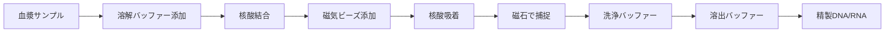

# 第3章: cfDNA/cfRNA同時抽出プロトコル

**文書番号**: MinION-Protocol-03
**バージョン**: 1.0
**作成日**: 2025年10月8日
**使用キット**: Zymo Research Quick-cfDNA/cfRNA™ Serum & Plasma Kit (Cat# D4076)

---

## 目次
1. [抽出原理と91病原体対応](#1-抽出原理と91病原体対応)
2. [必要試薬・機器](#2-必要試薬機器)
3. [実験前準備](#3-実験前準備)
4. [cfDNA抽出プロトコル](#4-cfdna抽出プロトコル)
5. [cfRNA抽出プロトコル](#5-cfrna抽出プロトコル)
6. [DNA+RNA同時抽出プロトコル](#6-dnarna同時抽出プロトコル)
7. [品質評価とQC](#7-品質評価とqc)
8. [トラブルシューティング](#8-トラブルシューティング)

---

## 1. 抽出原理と91病原体対応

### 1.1 Zymo Quick-cfDNA/cfRNA™ Kitの選定根拠

**本キットの技術的優位性**:

| 特徴 | 利点 | 91病原体検出への貢献 |
|-----|------|-------------------|
| **磁気ビーズ法** | 自動化対応、高再現性 | 大規模スクリーニングに適合 |
| **DNA+RNA同時抽出** | 1サンプルから両核酸取得 | DNAウイルス72種+RNAウイルス21種を同時カバー |
| **大容量対応** | 最大10 mL血漿処理 | 低コピー数病原体の検出感度向上 |
| **高収量** | 他社比1.5-2倍 | 微量病原体核酸の確実な回収 |
| **DNase/RNase不含** | コンタミなし | 偽陽性リスク最小化 |

**他社キットとの比較**:

| キット | DNA収量 | RNA収量 | 同時抽出 | 大容量対応 | 本プロトコル適合性 |
|-------|---------|---------|---------|-----------|------------------|
| **Zymo Quick-cfDNA/cfRNA™** | ✓✓✓ | ✓✓✓ | ✓ | 10 mL | **推奨** |
| QIAGEN QIAamp ccfDNA/RNA | ✓✓ | ✓✓ | △ | 5 mL | 代替可 |
| Norgen Plasma/Serum Kit | ✓✓ | ✓✓ | ✓ | 5 mL | 代替可 |
| QIAGEN miRNeasy Serum/Plasma | ✓ | ✓✓✓ | △ | 1 mL | RNA特化（DNA不適） |

### 1.2 磁気ビーズ法の原理

**ステップ概要**:



**化学的メカニズム**:

1. **溶解・変性**: カオトロピック塩（グアニジンチオシアネート等）が細胞膜・タンパク質を変性
2. **核酸吸着**: シリカ被覆磁気ビーズが核酸を静電的に吸着
3. **洗浄**: エタノール含有バッファーでタンパク質・塩類除去
4. **溶出**: 低塩濃度バッファー（TE, 水）で核酸を遊離

**91病原体への適用**:

| 病原体タイプ | 核酸サイズ範囲 | ビーズ吸着効率 | 備考 |
|-----------|-------------|-------------|------|
| DNAウイルス | 3 kb - 200 kb | 95-99% | 全サイズ範囲で高効率 |
| RNAウイルス | 0.5 kb - 30 kb | 90-98% | 小RNAもカバー |
| 細菌DNA断片 | 100 bp - 10 kb | 95-99% | cfDNA断片を効率回収 |
| 真菌DNA断片 | 100 bp - 10 kb | 95-99% | 同上 |
| 原虫DNA断片 | 100 bp - 10 kb | 95-99% | 同上 |
| PERV (RNA/DNA) | 8-9 kb | 98-99% | 全長ゲノム取得可能 |

### 1.3 DNA vs RNA抽出の違い

**並行抽出戦略の科学的根拠**:

```yaml
DNA抽出プロトコル:
  特徴:
    - DNase処理不要
    - 安定（RNase分解リスクなし）
    - 長期保存可能

  対象病原体:
    - DNAウイルス: 24種
    - 細菌: 27種
    - 真菌: 2種
    - 原虫・寄生虫: 19種

RNA抽出プロトコル:
  特徴:
    - RNase汚染に極めて脆弱
    - DNase処理でDNA除去（オプション）
    - 即座に解析 or -80℃保存

  対象病原体:
    - RNAウイルス: 20種
    - PERV転写産物（特別管理）

同時抽出の利点:
  - サンプル節約（10 mL → DNA 5 mL + RNA 5 mL）
  - 時間効率（並行処理）
  - コスト削減（キット1回分）
```

---

## 2. 必要試薬・機器

### 2.1 Zymo Quick-cfDNA/cfRNA™ Kit構成

**キット内容物（50 prep分）**:

| 試薬名 | 容量 | 保存温度 | 用途 | 使用時注意 |
|-------|------|---------|------|----------|
| cfDNA/RNA Binding Buffer | 125 mL | 室温 | 核酸溶解・結合 | 沈殿確認、必要時37℃溶解 |
| cfDNA/RNA Wash Buffer (Concentrate) | 48 mL | 室温 | 洗浄 | **使用前に100%エタノール192 mL添加必須** |
| DNase/RNase-Free Water | 10 mL | 室温 | 溶出 | 代替可: TE buffer pH 8.0 |
| MagBinding Beads | 6 mL | 4℃ | 核酸吸着 | **使用前によく撹拌（ボルテックス30秒）** |
| Proteinase K (20 mg/mL) | 1.25 mL | -20℃ | タンパク質分解 | 凍結融解回避 |
| Zymo-Spin™ IC Columns | 50個 | 室温 | RNA精製用 | DNA抽出時は不使用 |
| Collection Tubes | 50個 | 室温 | 廃液回収 | - |

**重要な準備作業**:

```yaml
キット受領時の必須作業:

  1_Wash_Buffer調製:
    - Wash Buffer Concentrate 48 mL
    - + 100%エタノール 192 mL
    - = Working Wash Buffer 240 mL
    - ボトルにチェックマーク記入「エタノール添加済」
    - 日付・担当者記録

  2_試薬点検:
    □ Binding Buffer沈殿なし（あれば37℃で溶解）
    □ Beads均一（分離あれば撹拌）
    □ Proteinase K -20℃保存確認
    □ 有効期限確認
```

### 2.2 追加必要試薬

| 試薬名 | 用途 | 推奨品 | 保存温度 |
|-------|------|--------|---------|
| **100%エタノール** | Wash Buffer調製、追加洗浄 | 分子生物学グレード | 室温 |
| **70%エタノール** | 器具消毒 | - | 室温 |
| **TE Buffer pH 8.0** | DNA溶出（代替） | 10 mM Tris, 0.1 mM EDTA | 室温 |
| **RNase-free Water** | RNA溶出 | DEPC処理水、またはキット付属 | 室温 |
| **Proteinase K** | 追加用（大容量処理時） | Zymo or QIAGEN | -20℃ |

### 2.3 必要機器

#### 2.3.1 コア機器

| 機器名 | 仕様 | 用途 | 推奨機種 |
|-------|------|------|---------|
| **磁気スタンド** | 6-12ポジション、1.5-2 mL tube対応 | ビーズ捕捉 | Zymo MagStand-96, Promega MagneSphere |
| **ボルテックスミキサー** | 可変速度 | ビーズ撹拌、混合 | VWR, Scientific Industries |
| **マイクロピペット** | 10-100 μL, 100-1000 μL | 試薬分注 | Eppendorf, Gilson |
| **クリーンベンチ** | Class II, UV照射付き | 無菌操作 | - |
| **ヒートブロック** | 37-56℃ | Proteinase K反応 | - |
| **卓上遠心機** | Mini centrifuge | スピンダウン | - |

#### 2.3.2 定量・品質評価機器

| 機器名 | 測定項目 | 本プロトコルでの用途 | 必須度 |
|-------|---------|-------------------|-------|
| **Qubit 4 Fluorometer** | DNA/RNA濃度（高感度） | 抽出核酸定量 | **必須** |
| **Bioanalyzer / TapeStation** | DNA/RNAサイズ分布、完全性 | 品質評価 | **必須** |
| **NanoDrop** | 吸光度（260/280, 260/230比） | 純度評価 | 推奨 |
| **qPCR装置** | コピー数定量 | 宿主DNA除去効率評価 | 推奨 |

### 2.4 消耗品

| 消耗品名 | 仕様 | 数量/サンプル | 推奨品 |
|---------|------|-------------|--------|
| **1.5 mL tube (DNA/RNase-free)** | Low-bind | 10本 | Eppendorf LoBind |
| **2 mL tube (DNA/RNase-free)** | Low-bind, スクリューキャップ | 5本 | Eppendorf LoBind |
| **フィルターチップ** | 10 μL, 200 μL, 1000 μL | 各10本 | - |
| **15 mL遠沈管** | DNA/RNase-free | 2本 | Falcon |

---

## 3. 実験前準備

### 3.1 作業環境準備

**クリーンベンチ準備**:

```yaml
UV照射と清拭:
  1. UV照射: 30分間
  2. 70%エタノールで作業面清拭
  3. RNaseZap処理（RNA抽出時必須）
     - スプレーして5分放置
     - RNase-free水で拭き取り
     - 完全乾燥

器具配置:
  - 最小限の物品のみ庫内配置
  - 試薬ボトルは外で開封、必要量のみ移す
  - ゴミ箱、廃液容器を準備
```

### 3.2 サンプル準備

**融解プロトコル**:

```yaml
-80℃保存血漿の融解:
  1. -80℃フリーザーから取り出し
  2. 4℃冷蔵庫で2-4時間融解
  3. 完全融解確認（目視）
  4. ボルテックス 5秒（低速）
  5. 卓上遠心 1,000×g、1分（液滴を底に）
  6. クリーンベンチに移動

サンプル量確認:
  - ピペットで吸引し容量確認
  - 記録: 正確な容量
  - 推奨投入量: 5-10 mL（最大処理量）
```

### 3.3 試薬準備

**当日準備チェックリスト**:

```yaml
□ Binding Buffer 沈殿確認 → なし or 37℃溶解済
□ Wash Buffer エタノール添加確認 → 済（ラベル確認）
□ MagBinding Beads ボルテックス30秒 → 均一懸濁
□ Proteinase K -20℃から取り出し → 氷上融解
□ DNase/RNase-Free Water 室温に放置
□ 100%エタノール 残量確認
□ ピペットチップ 十分量準備

使用直前の混合:
  - Binding Buffer: 転倒混和5回
  - Wash Buffer: 転倒混和5回
  - Beads: ボルテックス10秒（使用直前毎回）
```

---

## 4. cfDNA抽出プロトコル

### 4.1 プロトコル概要

**全体フロー（所要時間: 約90分）**:

```
血漿サンプル（5-10 mL）
  ↓ Proteinase K処理（56℃, 30分）
  ↓ Binding Buffer添加
  ↓ MagBinding Beads添加
  ↓ 磁気捕捉
  ↓ Wash Buffer洗浄 ×2回
  ↓ エタノール洗浄 ×1回
  ↓ 乾燥
  ↓ 溶出
精製cfDNA（30-50 μL）
```

### 4.2 詳細プロトコル（10 mLサンプル）

#### Step 1: Proteinase K処理

**目的**: タンパク質分解、核酸遊離

```yaml
試薬添加:
  1. 15 mL遠沈管（DNA/RNase-free）に血漿10 mL移す
  2. Proteinase K 50 μL添加（最終濃度 100 μg/mL）
  3. キャップをしっかり閉め、転倒混和10回
  4. ヒートブロック56℃で30分インキュベート
     - 10分ごとに転倒混和（3回実施）

条件詳細:
  温度: 56℃ ± 2℃
  時間: 30分（厳守）
  撹拌: 10分ごと（重要、沈殿防止）

品質チェック:
  - 液が透明化（タンパク質分解の指標）
  - 沈殿なし
  - あれば追加10分インキュベート
```

#### Step 2: Binding Buffer添加

**目的**: 核酸の変性・結合条件設定

```yaml
試薬計算:
  血漿量: 10 mL
  Binding Buffer量: 10 mL × 4 = 40 mL

添加手順:
  1. 56℃インキュベート後、室温まで冷却（5分）
  2. Binding Buffer 40 mL添加
     - ボトルから直接添加 or メスシリンダーで計量
  3. キャップをしっかり閉める
  4. 転倒混和20回（十分混合重要）
  5. 室温で5分静置

確認ポイント:
  - 総容量: 約50 mL
  - 均一に混合（層分離なし）
  - 沈殿なし
```

#### Step 3: MagBinding Beads添加

**目的**: DNA吸着

```yaml
Beads量計算:
  血漿量: 10 mL
  Beads量: 10 mL × 100 μL/mL = 1,000 μL = 1 mL

Beads準備:
  1. MagBinding Beadsボトルをボルテックス30秒
     - 完全に均一な懸濁液にする
  2. 即座に1 mL吸引（沈降前）

添加・混合:
  1. Beads 1 mL をサンプルに添加
  2. 即座にキャップを閉め、転倒混和30回
     - ゆっくり、確実に
     - Beadsが完全に懸濁していることを確認
  3. 室温で10分インキュベート
     - 5分時点で再度転倒混和10回

DNA結合確認:
  - Beadsが茶色っぽく変色（DNA吸着の指標）
```

#### Step 4: 磁気捕捉・上清除去

**目的**: DNA結合Beadsの分離

```yaml
磁気捕捉:
  使用機器: 15 mL tube用磁気スタンド

  手順:
    1. チューブを磁気スタンドにセット
    2. 3-5分静置
       - Beadsが完全にチューブ壁に捕捉されるまで
       - 上清が透明になることを確認

    3. 上清を吸引除去
       - 10 mL血清ピペットまたはアスピレーター使用
       - Beadsを吸引しないよう注意
       - ピペット先端をBeadsの反対側に

    4. 廃液容器に廃棄

注意:
  - Beads損失を最小化（<5%）
  - 少量の上清残存はOK（次の洗浄で除去）
```

#### Step 5: Wash Buffer洗浄（1回目）

**目的**: タンパク質・塩類の除去

```yaml
洗浄手順:
  1. チューブを磁気スタンドから外す
  2. Wash Buffer 10 mL添加
  3. キャップを閉め、ボルテックス10秒
     - Beadsを完全に再懸濁
  4. 磁気スタンドにセット、3分静置
  5. 上清を完全に除去

重要ポイント:
  - ボルテックス時、Beadsが完全に浮遊すること
  - 磁気捕捉時、上清が透明なこと
  - 上清除去は可能な限り完全に
```

#### Step 6: Wash Buffer洗浄（2回目）

```yaml
2回目洗浄:
  - Step 5と全く同じ手順を繰り返す
  - 洗浄効率向上のため2回実施必須
```

#### Step 7: エタノール洗浄

**目的**: 塩類の完全除去、Beads洗浄

```yaml
エタノール洗浄:
  1. チューブを磁気スタンドから外す
  2. 100%エタノール 10 mL添加
  3. キャップを閉め、ボルテックス10秒
  4. 磁気スタンドにセット、3分静置
  5. 上清を完全に除去
     - エタノールは可能な限り完全に除去
     - 残存エタノールは溶出阻害
```

#### Step 8: 乾燥

**目的**: 残存エタノールの完全除去

```yaml
乾燥手順:
  1. チューブを磁気スタンドから外す
  2. キャップを開けたまま室温で5-10分放置
     - クリーンベンチ内で実施
     - ホコリ混入防止のため開口部をパラフィルムで軽くカバー

  3. 完全乾燥の確認:
     - Beadsが完全に乾燥（湿り気なし）
     - 過度な乾燥は避ける（10分超えない）
     - Beadsが白色化（乾燥指標）

過乾燥の弊害:
  - DNA溶出効率低下
  - 目安: 5-7分で十分
```

#### Step 9: 溶出

**目的**: 精製cfDNAの回収

```yaml
溶出バッファー選択:
  Option_A: DNase/RNase-Free Water（推奨）
    - MinION適合性高い
    - 長期保存やや不安定

  Option_B: TE Buffer pH 8.0
    - 長期保存安定
    - EDTA含有（一部酵素阻害の可能性）
    - MinION: 問題なし使用可

溶出手順:
  1. DNase/RNase-Free Water 50 μL添加
     - Beadsに直接添加
  2. ピペッティング10回
     - Beadsを完全に再懸濁
  3. 室温で5分インキュベート
     - 時々軽く混合（2-3回）

  4. 磁気スタンドにセット、3分静置
  5. 上清（= 精製cfDNA）を新しい1.5 mL tube（Low-bind）に移す
     - 容量: 約45 μL（5 μLはBeads吸着）
     - Beadsを吸引しないよう注意

  6. ラベル貼付: サンプルID-DNA、日付、抽出者

溶出量の最適化:
  - 50 μL: 標準（濃度と総量のバランス）
  - 30 μL: 高濃度希望時
  - 100 μL: 低濃度でも総量確保したい時
```

### 4.3 複数サンプル処理のコツ

**バッチ処理（6-12サンプル同時）**:

```yaml
効率化戦略:
  並行処理:
    - Proteinase K処理: 全サンプル同時（ヒートブロック複数穴）
    - Binding Buffer添加: 1サンプルずつ順次
    - Beads添加: 1サンプルずつ順次（Beads沈降防止）
    - 洗浄: 全サンプル同時（磁気スタンド Multi-position）

  タイムマネジメント:
    00:00 Proteinase K 添加（全サンプル）
    00:30 Binding Buffer添加開始（サンプル1）
    00:35 Beads添加開始（サンプル1）
    00:40 磁気捕捉開始（サンプル1）
    00:45 洗浄開始（サンプル1、以降全サンプル並行）

  記録:
    - 各サンプルの各ステップ完了時刻記録
    - エラー・逸脱があれば即座に記録
```

---

## 5. cfRNA抽出プロトコル

### 5.1 RNA抽出の特別な注意事項

**RNase汚染防止の徹底**:

```yaml
RNA専用対策:

  作業環境:
    - クリーンベンチをRNaseZapで処理
    - RNA専用ピペット使用（DNA用と分離）
    - RNA専用チップボックス

  試薬:
    - 全てRNase-free認証品使用
    - 水はDEPC処理水またはキット付属品
    - エタノールは開封直後のみ使用

  操作:
    - 手袋頻繁交換（5サンプルごと）
    - 会話最小限（飛沫によるRNase混入）
    - 迅速作業（RNase分解時間最小化）
```

### 5.2 cfRNA抽出プロトコル（5 mLサンプル）

**cfDNA抽出との主な違い**:
- Zymo-Spin™ IC Columnを使用（追加精製ステップ）
- DNase処理オプション（DNA混入除去）
- より厳密なRNase-free環境

#### Step 1-8: Beads精製（cfDNAと同一）

```yaml
手順:
  - Step 1-8は cfDNA抽出プロトコル（4.2）と全く同じ
  - サンプル量を5 mLに読み替え:
    * Proteinase K: 25 μL
    * Binding Buffer: 20 mL
    * MagBinding Beads: 500 μL
    * Wash Buffer: 5 mL × 2回
    * 100% Ethanol: 5 mL
```

#### Step 9: Zymo-Spin™ IC Column精製

**目的**: RNA高純度化、微量DNA除去

```yaml
Column精製手順:

  1. Beads乾燥後、RNase-free Water 100 μL添加
  2. ピペッティング10回、Beads再懸濁
  3. 室温5分インキュベート
  4. 磁気スタンド3分 → 上清回収（= 粗RNA）

  5. Zymo-Spin™ IC Columnを Collection Tubeにセット
  6. 粗RNA 100 μL をColumnにロード
  7. 卓上遠心 12,000×g、1分
     - RNAがColumn膜に吸着
     - Flow-throughは廃棄

  8. RNA Wash Buffer 400 μL 添加
  9. 遠心 12,000×g、1分
  10. Flow-through廃棄

  11. 再度 RNA Wash Buffer 400 μL 添加
  12. 遠心 12,000×g、1分
  13. Flow-through廃棄

  14. 空遠心 12,000×g、2分（完全乾燥）

  15. Columnを新しい1.5 mL tubeに移す
  16. RNase-free Water 30 μL を膜中心に添加
  17. 室温5分静置
  18. 遠心 12,000×g、1分

  19. 溶出液（= 精製cfRNA）を回収
      - 容量: 約25-28 μL
```

### 5.3 DNase処理（オプション）

**いつ実施するか？**:
- DNA病原体とRNA病原体を厳密に区別したい場合
- RNA-seqでDNA混入が問題となる場合
- 通常のスクリーニングでは **不要**（DNA/RNA両方解析するため）

**DNase処理プロトコル（オプション）**:

```yaml
DNase処理:
  使用キット: TURBO DNase Kit (Ambion)

  手順:
    1. 精製cfRNA 25 μL
    2. TURBO DNase Buffer 3 μL
    3. TURBO DNase 2 μL
    4. 総量 30 μL、ピペッティング混合

    5. 37℃で30分インキュベート

    6. DNase Inactivation Reagent 3 μL添加
    7. 室温2分、時々混合
    8. 遠心 10,000×g、1.5分
    9. 上清を新しいチューブに移す（= DNase処理RNA）
```

---

## 6. DNA+RNA同時抽出プロトコル

### 6.1 同時抽出戦略

**1サンプルから両核酸取得の最適化**:

```yaml
戦略:
  Option_A: サンプル分割法（推奨）
    血漿10 mL:
      → 5 mL: DNA抽出
      → 5 mL: RNA抽出
    利点: 各抽出を独立最適化
    欠点: サンプル量必要

  Option_B: Beads分割法
    血漿10 mL:
      → Beads精製（Step 1-8）まで共通
      → 溶出時に分割:
        * 50 μL water溶出 → DNA用
        * Beadsを再度洗浄 → Column精製 → RNA用
    利点: サンプル節約
    欠点: やや複雑、収量低下

本プロトコル推奨: Option A（サンプル分割法）
```

### 6.2 サンプル分割法の詳細

**実施手順**:

```yaml
Day_1_サンプル分割:
  1. 融解した血漿10 mLを2本の15 mL tubeに分注
     - Tube A: 5 mL（DNA抽出用）
     - Tube B: 5 mL（RNA抽出用）

  2. ラベル貼付:
     - Tube A: [サンプルID]-DNA
     - Tube B: [サンプルID]-RNA

  3. 並行処理開始:
     - Tube A: cfDNA抽出プロトコル（Section 4）
     - Tube B: cfRNA抽出プロトコル（Section 5）

タイムライン:
  00:00 両チューブにProteinase K添加、56℃開始
  00:30 両チューブにBinding Buffer添加
  00:35 両チューブにBeads添加
  00:45 磁気捕捉開始（同時処理）
  01:00 洗浄開始（同時処理）
  01:30 DNA溶出完了
  01:35 RNA Column精製開始
  02:00 RNA溶出完了

所要時間: 約2時間（並行処理）
```

---

## 7. 品質評価とQC

### 7.1 Qubit定量

**DNA定量（Qubit dsDNA HS Assay）**:

```yaml
測定手順:
  1. Qubit試薬調製:
     - Qubit dsDNA HS Buffer 199 μL
     - Qubit dsDNA HS Reagent 1 μL
     - = Working Solution 200 μL/サンプル

  2. 標準曲線用チューブ準備:
     - Standard #1: 10 μL + Working Solution 190 μL
     - Standard #2: 10 μL + Working Solution 190 μL

  3. サンプルチューブ準備:
     - cfDNA 2 μL + Working Solution 198 μL

  4. 全チューブをボルテックス2-3秒
  5. 室温2分インキュベート

  6. Qubit 4で測定:
     - Calibrate with Standards
     - Read Sample

期待値:
  cfDNA濃度: 1-10 ng/μL（5 mL血漿から50 μL溶出時）
  総量: 50-500 ng

  計算例:
    濃度 5 ng/μL × 容量 45 μL = 225 ng総量
```

**RNA定量（Qubit RNA HS Assay）**:

```yaml
測定手順:
  - DNA定量と同じ手順
  - Qubit RNA HS Assay Kit使用

期待値:
  cfRNA濃度: 0.5-5 ng/μL（5 mL血漿から30 μL溶出時）
  総量: 15-150 ng

判定:
  - 総量 >50 ng: 十分（ライブラリ調製可能）
  - 総量 20-50 ng: やや少ない（継続可能）
  - 総量 <20 ng: 不足（再抽出検討、またはPCR増幅）
```

### 7.2 Bioanalyzer品質評価

**DNA品質評価（Bioanalyzer High Sensitivity DNA Assay）**:

```yaml
測定項目:
  1. DNA Integrity Number (DIN):
     - DIN 7-10: 高品質（完全性高い）
     - DIN 5-7: 中品質（やや断片化）
     - DIN <5: 低品質（著しく断片化）

  2. サイズ分布:
     - cfDNAピーク位置: 150-200 bp（ヌクレオソーム単位）
     - 病原体DNA断片: 100 bp - 10 kb（広範囲）

  3. 高分子量DNA混入:
     - >10 kb DNA存在 → ゲノムDNA混入の可能性
     - 原因: 溶血、白血球混入
     - 対処: 血漿分離を再度遠心（16,000×g）

期待プロファイル:
  - メインピーク: 150-200 bp
  - 広いtailing: 200 bp - 1 kb
  - 高分子量DNA: 最小限
```

**RNA品質評価（Bioanalyzer RNA 6000 Pico Assay）**:

```yaml
測定項目:
  1. RNA Integrity Number (RIN):
     - RIN 8-10: 高品質（分解最小）
     - RIN 6-8: 中品質（軽度分解）
     - RIN <6: 低品質（著しく分解）

  2. サイズ分布:
     - 小RNA: <200 nt（miRNA等）
     - 中RNA: 200-2,000 nt
     - 大RNA: >2,000 nt（rRNA等、混入指標）

  3. 分解パターン:
     - スメアパターン → 分解RNA
     - シャープなバンド → 良好

期待プロファイル:
  - 広いサイズ分布（病原体RNAは多様）
  - RIN >7（高品質）
  - rRNAバンド最小（細胞混入なし）
```

### 7.3 NanoDrop純度評価

**260/280比と260/230比**:

```yaml
測定手順:
  1. NanoDrop装置の清拭・Blank測定
  2. cfDNA/cfRNA 1-2 μL をロード
  3. 吸光度測定

評価指標:
  260/280比（タンパク質混入指標）:
    - DNA: 1.8-2.0（理想1.8）
    - RNA: 2.0-2.2（理想2.0）
    - <1.7: タンパク質混入
    - >2.3: RNA分解産物混入（DNA時）

  260/230比（有機溶媒・塩混入指標）:
    - 理想: 2.0-2.2
    - <1.8: グアニジン塩、フェノール残存
    - >2.5: 測定エラー or 極低濃度

対処:
  - 260/280 <1.7: 再抽出（Proteinase K時間延長）
  - 260/230 <1.8: エタノール沈殿で精製
```

### 7.4 QC合否判定基準

**総合判定表**:

| QC項目 | 測定法 | 合格基準 | 警告域 | 不合格（再抽出） |
|-------|--------|---------|-------|----------------|
| **DNA濃度** | Qubit | >2 ng/μL | 1-2 ng/μL | <1 ng/μL |
| **DNA総量** | 計算 | >100 ng | 50-100 ng | <50 ng |
| **DNA DIN** | Bioanalyzer | >7 | 5-7 | <5 |
| **DNA 260/280** | NanoDrop | 1.8-2.0 | 1.7-1.8, 2.0-2.2 | <1.7, >2.2 |
| **DNA 260/230** | NanoDrop | >2.0 | 1.8-2.0 | <1.8 |
| **RNA濃度** | Qubit | >1 ng/μL | 0.5-1 ng/μL | <0.5 ng/μL |
| **RNA総量** | 計算 | >30 ng | 15-30 ng | <15 ng |
| **RNA RIN** | Bioanalyzer | >7 | 6-7 | <6 |
| **RNA 260/280** | NanoDrop | 2.0-2.2 | 1.9-2.0, 2.2-2.3 | <1.9, >2.3 |

**総合判定**:
- 全項目合格 → **ライブラリ調製へ進む**
- 1項目警告 → **記録して継続**
- 2項目以上警告 or 1項目不合格 → **再抽出実施**

---

## 8. トラブルシューティング

### 8.1 低収量（DNA/RNA量不足）

| 原因 | 対処法 |
|-----|--------|
| サンプル量不足 | 血漿量を10 mLに増量 |
| 溶血による核酸分解 | 血漿分離を迅速化、Grade 0-1のみ使用 |
| Proteinase K不活性 | 新鮮なProteinase K使用、-20℃保存徹底 |
| Beads量不足 | Beads量を1.5倍に増量（150 μL/mL血漿） |
| 溶出不完全 | 溶出時のインキュベート時間延長（10分） |
| 過乾燥 | 乾燥時間短縮（5分）、溶出前にwater少量添加 |

### 8.2 低純度（260/280, 260/230比異常）

| 問題 | 原因 | 対処法 |
|-----|------|--------|
| 260/280 <1.7 | タンパク質混入 | Proteinase K時間延長、追加Wash Buffer洗浄 |
| 260/230 <1.8 | グアニジン塩残存 | 追加エタノール洗浄、乾燥時間延長 |
| 260/280 >2.2 | RNA混入（DNA抽出時） | RNase A処理、またはColumn精製 |

### 8.3 RNA分解（低RIN）

| 原因 | 予防・対処法 |
|-----|----------|
| RNase汚染 | RNaseZap処理徹底、専用器具使用 |
| 血漿分離遅延 | 採血後30分以内に分離 |
| 融解時の分解 | 4℃緩慢融解、融解後即座に抽出 |
| 長期保存による分解 | -80℃保存、6ヶ月以内使用 |

### 8.4 Beads損失

| 問題 | 原因 | 対処法 |
|-----|------|--------|
| Beads吸引 | ピペット操作ミス | 慎重なピペッティング、Beads反対側から吸引 |
| Beads残存（上清中） | 磁気捕捉不完全 | 静置時間延長（5分）、磁石位置調整 |
| Beads凝集 | 乾燥しすぎ | 適度な乾燥（5-7分）、溶出時に十分再懸濁 |

---

## 本章のまとめ

本章で習得した技術:

✓ **91病原体対応核酸抽出**: DNA 72種+RNA 21種を同時カバー
✓ **高収量抽出**: 10 mL血漿から100-500 ng DNA, 30-150 ng RNA
✓ **磁気ビーズ法**: 自動化対応、高再現性
✓ **品質管理**: Qubit, Bioanalyzer, NanoDrop三重評価
✓ **RNase管理**: RNA専用環境、厳格な汚染防止

**重要タイムライン（DNA+RNA並行）**:
```
Day 1:
  09:00 サンプル融解開始（4℃、2-4時間）
  13:00 抽出開始
  15:00 抽出完了
  15:30 Qubit定量完了
  16:00 Bioanalyzer評価完了
  16:30 QC判定、記録

所要時間: 約3.5時間（待機時間含む）
実験時間: 約2時間（hands-on）
```

**次章**: 第4章では、抽出したcfDNAから宿主（ブタ）DNA/RNAを除去し、病原体核酸を濃縮するプロトコルを提供します。

---

**文書管理**:
- 作成者: [氏名]
- 承認者: [氏名]
- 改訂履歴: v1.0 (2025-10-08)
