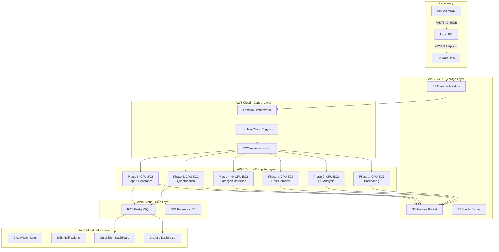
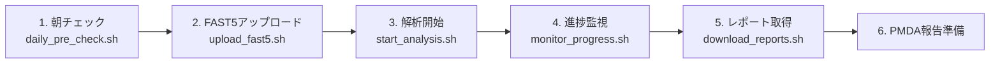
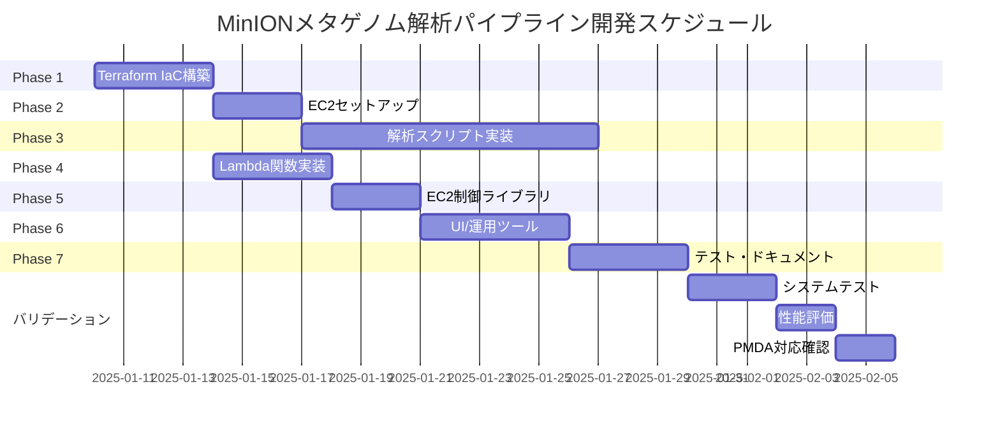

# MinIONメタゲノム解析パイプライン開発計画書

**【実装方式】本システムはDockerコンテナを使用せず、Lambda関数によるEC2インスタンス起動とカスタムAMIによる解析を実装します。**

## 1. エグゼクティブサマリー

### 1.1 プロジェクト概要
- **目的**: 異種移植用ドナーブタのPMDA指定91病原体を検出するメタゲノム解析システム構築
- **技術基盤**: Oxford Nanopore MinION Mk1D + AWS クラウド（Dockerコンテナ不使用）
- **実装方式**: Lambda + EC2カスタムAMI（コンテナレス・サーバーレスアーキテクチャ）
- **開発期間**: 28-36日（約1.5ヶ月）
- **総ファイル数**: 68ファイル

### 1.2 主要機能
1. MinION FAST5データの自動処理
2. 7フェーズ解析パイプライン（Basecalling → QC → Host除去 → 病原体検出 → 定量 → レポート）
3. PMDA規制準拠のデータ管理・監査証跡
4. リアルタイムダッシュボード監視
5. 自動レポート生成（PDF/HTML）

### 1.3 期待される成果
- **処理時間（TAT）**: 12-20時間/サンプル
- **精度**: 種レベル同定98-99.5%、LOD 50-100 copies/mL
- **コスト**: 約2,100-2,400円/サンプル（AWS利用料）
- **スケーラビリティ**: 年間24-100サンプル対応可能

----

## 2. システムアーキテクチャ

### 2.1 全体構成図



### 2.2 技術スタック

| レイヤー | 技術要素 | 詳細 |
|---------|----------|------|
| **シーケンシング** | MinION Mk1D | R10.4.1 フローセル、Duplex mode |
| **データ転送** | AWS CLI/Rclone | 100Mbps以上推奨 |
| **ストレージ** | AWS S3 | 3バケット（raw-data, analysis, scripts） |
| **コンピューティング** | AWS EC2 | g4dn.xlarge (GPU), r5/c5 (CPU)、カスタムAMI |
| **オーケストレーション** | AWS Lambda | Python 3.11、16関数（フェーズ制御） |
| **ワークフロー管理** | AWS Step Functions | 状態管理、エラーハンドリング |
| **データベース** | RDS PostgreSQL | db.t3.medium、100GB |
| **参照データ** | AWS EFS | PMDA 91病原体DB、Sus scrofa genome（マウント共有） |
| **インスタンス管理** | SSM（Systems Manager） | EC2アクセス、コマンド実行 |
| **モニタリング** | CloudWatch, SNS | ログ、メトリクス、アラート |
| **可視化** | QuickSight, Grafana | ダッシュボード |
| **IaC** | Terraform | v1.5+ |

### 2.3 データフロー

```yaml
1. MinION Sequencing:
   Input: ブタ血漿cfDNA/cfRNA
   Output: FAST5 files (30-50GB)
   Duration: 6-48時間

2. S3 Upload:
   Input: FAST5 files
   Output: s3://minion-raw-data/{run_id}/
   Duration: 2-4時間

3. Lambda Orchestrator:
   Trigger: S3 event notification
   Action: Step Functions起動、ワークフローID生成、EC2インスタンス起動

4. Phase 1-6 Pipeline:
   Phase 1: Basecalling (6-8時間, GPU)
   Phase 2: QC (30分, CPU)
   Phase 3: Host Removal (1-2時間, CPU)
   Phase 4: Pathogen Detection (2-4時間, 4並列CPU)
   Phase 5: Quantification (30分, CPU)
   Phase 6: Report Generation (30分, CPU)

5. Data Output:
   - S3: 解析結果、レポート
   - RDS: メタデータ、定量結果
   - SNS: 完了通知
```

----

## 3. 開発計画詳細

### 3.1 プロジェクトディレクトリ構造

```
minion-metagenomics-pipeline/
├── infrastructure/              # AWS Infrastructure as Code
│   ├── terraform/              # Terraform設定（12ファイル）
│   │   ├── main.tf            # メイン設定
│   │   ├── variables.tf       # 変数定義
│   │   ├── s3.tf             # S3バケット
│   │   ├── rds.tf            # RDSデータベース
│   │   ├── efs.tf            # EFSファイルシステム
│   │   ├── iam.tf            # IAMロール・ポリシー
│   │   ├── lambda.tf          # Lambda関数定義
│   │   ├── ec2_ami.tf        # EC2 AMI設定
│   │   ├── eventbridge.tf    # イベント連携
│   │   ├── sns.tf            # 通知設定
│   │   ├── cloudwatch.tf     # 監視設定
│   │   └── outputs.tf        # 出力値定義
│   └── database/
│       ├── schema.sql         # DBスキーマ
│       └── seed_data.sql      # 初期データ
│
├── ec2_setup/                  # EC2環境構築（9ファイル）
│   ├── build_basecalling_ami.sh
│   ├── build_analysis_ami.sh
│   ├── install_dorado.sh
│   ├── install_qc_tools.sh
│   ├── install_alignment_tools.sh
│   ├── install_kraken2.sh
│   ├── install_blast.sh
│   ├── install_assembly_tools.sh
│   └── install_python_env.sh
│
├── scripts/                    # 解析スクリプト（24ファイル）
│   ├── phase1_basecalling/    # (2ファイル)
│   ├── phase2_qc/             # (2ファイル)
│   ├── phase3_host_removal/   # (2ファイル)
│   ├── phase4_pathogen/       # (7ファイル)
│   ├── phase5_quantification/ # (5ファイル)
│   └── phase6_reports/        # (4ファイル)
│
├── lambda/                     # Lambda関数（16ファイル）
│   ├── orchestrator/          # (3ファイル) - S3トリガー、ワークフロー開始
│   ├── phases/                # (7ファイル) - 各フェーズEC2起動
│   ├── validators/            # (3ファイル) - 入力検証、QC判定
│   └── metadata/              # (3ファイル) - RDS更新、通知
│
├── ec2_runner/                 # EC2制御（10ファイル）
│   ├── ec2_manager.py
│   ├── userdata_templates/    # (9ファイル)
│   └── requirements.txt
│
├── templates/                  # テンプレート（3ファイル）
├── dashboards/                 # ダッシュボード（4ファイル）
├── utils/                      # 運用ツール（7ファイル）
├── tests/                      # テスト（5ファイル）
├── config/                     # 設定（3ファイル）
└── docs/                       # ドキュメント（4ファイル）
```

### 3.2 開発フェーズと工数

| フェーズ | 内容 | ファイル数 | 工数 | 依存関係 |
|---------|------|-----------|------|----------|
| **Phase 1** | Terraform IaC構築 | 12 | 3-4日 | - |
| **Phase 2** | EC2セットアップスクリプト | 9 | 2-3日 | Phase 1 |
| **Phase 3** | 解析スクリプト実装 | 24 | 8-10日 | Phase 2 |
| **Phase 4** | Lambda関数実装 | 16 | 3-4日 | Phase 1 |
| **Phase 5** | EC2制御・UserDataテンプレート | 10 | 2-3日 | Phase 4 |
| **Phase 6** | UI/運用ツール | 14 | 4-5日 | Phase 5 |
| **Phase 7** | テスト・ドキュメント | 9 | 3-4日 | Phase 6 |
| **合計** | - | **68** | **28-36日** | - |

----

## 4. 技術仕様詳細

### 4.1 Phase 1: Basecalling（GPU処理）

#### 4.1.1 処理概要
```yaml
目的: FAST5 → FASTQ変換（Duplex mode、Q30精度）
入力: FAST5 raw signal files (30-50GB)
出力: FASTQ.gz (5-10GB) + sequencing_summary.txt
処理時間: 6-8時間
インスタンス: g4dn.xlarge (NVIDIA T4 GPU、16GB VRAM)
起動方法: Lambda関数がEC2インスタンスをSpot方式で起動
```

#### 4.1.2 主要パラメータ
```bash
Dorado設定:
- Model: dna_r10.4.1_e8.2_400bps_sup@v4.3.0
- Mode: Duplex (両鎖読み取り)
- Min Q-score: 10
- Device: cuda:0
- Batch size: Auto
```

#### 4.1.3 品質基準
- Total bases: ≥25 GB
- Mean Q score: ≥18
- Read N50: ≥8 kb
- Active channels: ≥1,200

### 4.2 Phase 2: Quality Control

#### 4.2.1 処理概要
```yaml
目的: シーケンシング品質評価
入力: FASTQ + sequencing_summary.txt
出力: QC HTML report + metrics.json
処理時間: 30分
インスタンス: t3.large（汎用、コスト最適化）
起動方法: Lambda関数がPhase 1完了検知後に起動
```

#### 4.2.2 QCツール
- PycoQC: 総合的品質評価
- NanoPlot: リード長・品質分布
- FastQC: 塩基品質評価

### 4.3 Phase 3: Host Genome Removal

#### 4.3.1 処理概要
```yaml
目的: Sus scrofa (ブタ)ゲノム除去
入力: QC passed FASTQ
出力: Non-host FASTQ (期待5%残存)
処理時間: 1-2時間
インスタンス: r5.4xlarge（メモリ最適、128GB RAM）
参照データ: EFSマウント（/mnt/efs/host_genome/）
```

#### 4.3.2 処理ステップ
1. Minimap2アライメント（Sus scrofa 11.1 + 3KO-7TG-59PERV）
2. SAMtools フィルタリング（unmapped reads抽出）
3. 除去率計算（目標: 95-98%）

### 4.4 Phase 4: Pathogen Detection（4並列処理）

#### 4.4.1 Method A: Kraken2/Bracken
```yaml
目的: 高速病原体スクリーニング
処理時間: 10-20分
精度: 95-98%（種レベル）
データベース: PMDA 91病原体カスタムDB（25GB）、EFSマウント
インスタンス: r5.xlarge（メモリ最適化、32GB RAM）
並列実行: Lambda関数が4つのEC2を並列起動
```

#### 4.4.2 Method B: BLAST確認
```yaml
目的: 高精度確認
処理時間: 30-60分
閾値: E-value ≤1e-10, Identity ≥95%
インスタンス: c5.4xlarge（16 vCPU、32GB RAM）
データベース: EFSマウント（/mnt/efs/blast_db/）
```

#### 4.4.3 Method C: De novo Assembly
```yaml
目的: 未知病原体検出
処理時間: 2-4時間
ツール: Flye (metagenomic mode)
インスタンス: c5.8xlarge（32 vCPU、64GB RAM）
```

#### 4.4.4 Method D: PERV特異的解析
```yaml
目的: ブタ内在性レトロウイルス検出
処理時間: 1-2時間
解析内容:
- PERV-A/B/C型別
- Full-length genome (8-9kb)検出
- 組換え体検出
- 系統樹作成
インスタンス: t3.xlarge（汎用、4 vCPU、16GB RAM）
参照データ: EFSマウント（/mnt/efs/perv_db/）
```

### 4.5 Phase 5: Quantification

#### 4.5.1 処理概要
```yaml
目的: 病原体絶対定量
入力: Phase 4結果統合
出力: copies/mL定量値
処理時間: 30分
インスタンス: t3.large（汎用、コスト最適）
データ集約: 4並列結果をLambdaで集約後、EC2で定量計算
```

#### 4.5.2 定量手法
1. リードカウント集計
2. Spike-in補正（Lambda DNA）
3. ゲノム長正規化
4. 血漿量換算（copies/mL）

### 4.6 Phase 6: Report Generation

#### 4.6.1 処理概要
```yaml
目的: PMDA提出用レポート生成
出力形式: PDF, HTML
処理時間: 30分
インスタンス: t3.large（汎用）
最終処理: S3へアップロード後、SNS通知、EC2自己終了
```

#### 4.6.2 レポート内容
- QCサマリー
- 91病原体検出結果一覧
- 陽性病原体詳細（定量値、信頼度）
- PERV解析結果
- 監査証跡

----

## 5. 主要コンポーネント実装詳細

### 5.1 Terraform Infrastructure（Phase 1）

#### 5.1.1 AWS リソース定義
```hcl
# 主要リソース
- VPC (10.0.0.0/16)
- Subnets (Private×2, Public×2, Database×2)
- S3 Buckets (raw-data, analysis, scripts)
- RDS PostgreSQL (db.t3.medium, 100GB)
- EFS (参照データベース用)
- Lambda Functions (10個)
- IAM Roles/Policies
- SNS Topics
- CloudWatch Log Groups
```

#### 5.1.2 セキュリティ設定
- VPCフローログ有効化
- S3暗号化（AES-256）
- RDSパスワード（Secrets Manager管理）
- IAM最小権限原則

### 5.2 Lambda Functions（Phase 4）

#### 5.2.1 Orchestrator Lambda
```python
# lambda/orchestrator/start_workflow.py
責務:
- S3イベント受信（FAST5アップロード検知）
- Run ID生成（RUN-YYYY-MM-DD-XXX形式）
- Step Functions実行開始
- RDSワークフロー登録
実行時間: 3-5秒
```

#### 5.2.2 Phase Trigger Lambdas（7個）
```python
# lambda/phases/trigger_basecalling.py
# lambda/phases/trigger_qc.py
# lambda/phases/trigger_host_removal.py
# lambda/phases/trigger_pathogen_detection.py (4並列起動)
# lambda/phases/trigger_quantification.py
# lambda/phases/trigger_report.py
# lambda/phases/cleanup.py

責務:
- 前フェーズ完了検知（S3 + RDS状態確認）
- QC基準チェック（Phase 2のみ）
- EC2インスタンス起動（run_instances API）
- UserDataスクリプト注入
- Spot Instance Request（コスト削減）
- 12時間自動終了タイマー設定
- エラーハンドリング（3回リトライ）
実行時間: 5-10秒/フェーズ
```

#### 5.2.3 Utility Lambdas
```python
# lambda/validators/validate_fast5.py
- Input Validator: FAST5ファイル検証（形式、サイズ、完全性）

# lambda/validators/check_qc.py
- QC Checker: 品質基準判定（Q30、Read N50、Total bases）

# lambda/metadata/update_status.py
- Metadata Updater: RDS更新（workflow_executions、audit_logs）

# lambda/metadata/send_notification.py
- Notifier: SNS通知送信（開始、完了、エラー、PERV検出）
```

### 5.3 EC2 UserData Templates（Phase 5）

#### 5.3.1 基本構造
```bash
#!/bin/bash
set -euo pipefail

# CloudWatch Logsへストリーミング
exec > >(tee /var/log/minion-phase.log)
exec 2>&1

# Lambda関数から渡される環境変数
export RUN_ID='{{RUN_ID}}'
export S3_INPUT='s3://{{BUCKET}}/{{INPUT_PREFIX}}'
export S3_OUTPUT='s3://{{BUCKET}}/{{OUTPUT_PREFIX}}'
export PHASE='{{PHASE}}'

# EFSマウント（参照データベース）
mount -t efs {{EFS_DNS}}:/{{EFS_PATH}} /mnt/efs

# 作業ディレクトリ作成
mkdir -p /mnt/analysis/$RUN_ID
cd /mnt/analysis/$RUN_ID

# S3から解析スクリプトダウンロード（カスタムAMIに事前配置済み）
# /opt/minion/scripts/phase${PHASE}_*/

# 解析実行
/opt/minion/scripts/phase${PHASE}_*/run_analysis.sh \
  -i "$S3_INPUT" \
  -o "$S3_OUTPUT" \
  -r "$RUN_ID"

# 結果をS3へアップロード
aws s3 sync /mnt/analysis/$RUN_ID/output/ "$S3_OUTPUT"

# クリーンアップ
rm -rf /mnt/analysis/$RUN_ID

# SNS通知
aws sns publish \
  --topic-arn {{SNS_TOPIC}} \
  --subject "Phase ${PHASE} Complete - $RUN_ID" \
  --message "Phase ${PHASE} completed successfully for run $RUN_ID"

# EC2自己終了（完了後、コスト削減）
shutdown -h now
```

----

## 6. データベース設計

### 6.1 RDS PostgreSQL スキーマ

```sql
-- ワークフロー実行管理
CREATE TABLE workflow_executions (
    run_id VARCHAR(255) PRIMARY KEY,
    status VARCHAR(50) NOT NULL,
    started_at TIMESTAMP NOT NULL,
    completed_at TIMESTAMP,
    total_reads BIGINT,
    total_bases_gb DECIMAL(10,2),
    mean_qscore DECIMAL(5,2),
    n50 INTEGER,
    host_removal_rate DECIMAL(5,2)
);

-- 病原体検出結果
CREATE TABLE pathogen_detections (
    id SERIAL PRIMARY KEY,
    run_id VARCHAR(255) REFERENCES workflow_executions(run_id),
    pathogen_id INTEGER REFERENCES pmda_pathogens(id),
    detection_method VARCHAR(50),
    confidence_score DECIMAL(5,4),
    read_count INTEGER,
    coverage DECIMAL(10,2)
);

-- 定量結果
CREATE TABLE pathogen_quantifications (
    id SERIAL PRIMARY KEY,
    run_id VARCHAR(255) REFERENCES workflow_executions(run_id),
    pathogen_id INTEGER REFERENCES pmda_pathogens(id),
    copies_per_ml DECIMAL(15,2),
    rpm DECIMAL(10,2),
    tpm DECIMAL(10,2)
);

-- PMDA 91病原体マスタ
CREATE TABLE pmda_pathogens (
    id SERIAL PRIMARY KEY,
    pathogen_name_ja VARCHAR(255) NOT NULL,
    pathogen_name_en VARCHAR(255) NOT NULL,
    pathogen_type VARCHAR(50),
    risk_level VARCHAR(20),
    reference_genome_id VARCHAR(100)
);

-- PERV解析結果
CREATE TABLE perv_analysis (
    id SERIAL PRIMARY KEY,
    run_id VARCHAR(255) REFERENCES workflow_executions(run_id),
    perv_type VARCHAR(10),
    full_length_reads INTEGER,
    consensus_sequence TEXT,
    recombinant_detected BOOLEAN,
    phylogenetic_clade VARCHAR(100)
);

-- 監査ログ
CREATE TABLE audit_logs (
    id SERIAL PRIMARY KEY,
    run_id VARCHAR(255),
    phase VARCHAR(50),
    action VARCHAR(100),
    user_id VARCHAR(100),
    timestamp TIMESTAMP NOT NULL,
    details JSONB
);
```

----

## 7. 運用・保守計画

### 7.1 日次運用フロー



### 7.2 定期メンテナンス

| 頻度 | タスク | 実行内容 |
|------|--------|---------|
| **日次** | ログ確認 | CloudWatch Logs エラーチェック |
| **週次** | バックアップ確認 | RDS自動バックアップ検証 |
| **月次** | DB更新 | PMDA 91病原体DB更新 |
| **月次** | コスト最適化 | EC2/S3使用状況レビュー |
| **四半期** | AMI更新 | ソフトウェアバージョンアップ |
| **年次** | 災害復旧訓練 | フルリストア演習 |

### 7.3 監視・アラート設定

#### 7.3.1 CloudWatch Alarms
```yaml
Critical:
- PERV検出: 即座通知
- BSL-3病原体検出: 即座通知
- Pipeline失敗: 3回連続失敗時

High:
- EC2起動失敗
- RDS接続エラー
- S3アップロード失敗

Medium:
- ディスク使用率 >80%
- Lambda実行時間 >10分
```

### 7.4 バックアップ・リカバリ

```yaml
RDS:
- 自動バックアップ: 日次、7日保持
- スナップショット: 週次、4週保持

S3:
- Versioning: 有効
- Lifecycle: 90日後Glacier移行
- Cross-region replication: オプション

EFS:
- AWS Backup: 日次、30日保持
```

----

## 8. コスト見積もり

### 8.1 初期構築コスト

| 項目 | 内容 | コスト |
|------|------|--------|
| 開発人件費 | 1.5ヶ月×1名 | ¥1,500,000 |
| AWS初期設定 | VPC, RDS等 | ¥10,000 |
| ライセンス | なし（OSS利用） | ¥0 |
| **合計** | - | **¥1,510,000** |

### 8.2 月間運用コスト（24サンプル/年の場合）

| AWS サービス | 使用量 | 月額（円） |
|-------------|--------|-----------|
| EC2（Spot Instance） | 40時間/月（70%削減） | ¥1,800 |
| S3 | 500GB | ¥1,500 |
| RDS | db.t3.medium | ¥5,000 |
| EFS | 50GB | ¥2,000 |
| Lambda | 16関数、1,000実行/月 | ¥0（無料枠内） |
| Step Functions | 4,000状態遷移/月 | ¥100 |
| データ転送 | 100GB/月 | ¥1,000 |
| **合計** | - | **¥11,400** |

### 8.3 サンプルあたりコスト

```yaml
オンデマンドEC2モード（18時間）:
- EC2費用: ¥2,100
- S3費用: ¥100
- Lambda: ¥0（無料枠）
- その他: ¥100
- 合計: ¥2,300/サンプル

Spot Instance利用時（推奨）:
- EC2費用: ¥630（70%削減）
- S3費用: ¥100
- Lambda: ¥0（無料枠）
- その他: ¥100
- 合計: ¥830/サンプル
```

----

## 9. リスク管理

### 9.1 技術リスク

| リスク | 影響度 | 発生確率 | 対策 |
|--------|--------|----------|------|
| Basecalling精度不足 | 高 | 低 | Duplex mode使用、Q30基準 |
| PERV検出漏れ | 高 | 中 | DNA+RNA両ライブラリ実施 |
| Spot Instance中断 | 中 | 中 | チェックポイント保存、オンデマンドフォールバック |
| EC2起動失敗 | 中 | 低 | Lambda自動リトライ（3回）、代替AZ |
| データベース更新遅延 | 中 | 中 | 自動更新スクリプト |

### 9.2 運用リスク

| リスク | 影響度 | 発生確率 | 対策 |
|--------|--------|----------|------|
| オペレータミス | 中 | 中 | 自動化、ダブルチェック |
| データ損失 | 高 | 低 | 多重バックアップ |
| コスト超過 | 中 | 中 | Budget Alert設定 |
| 規制変更 | 高 | 低 | 定期的な規制動向確認 |

----

## 10. 品質保証

### 10.1 バリデーション計画

#### 10.1.1 分析バリデーション
```yaml
LOD（検出限界）:
- 目標: 50-100 copies/mL
- 方法: Spike-in実験（10段階希釈）

再現性:
- 目標: CV <10%
- 方法: 3反復×3オペレータ×3日

特異性:
- 目標: >99%
- 方法: 91病原体模擬サンプル

精度:
- 目標: PPA >95%, NPA >98%
- 方法: MiSeqとの並行比較
```

#### 10.1.2 システムバリデーション
- 単体テスト: 各スクリプト個別検証
- 統合テスト: End-to-End実行
- 性能テスト: 50GB FAST5処理
- 障害テスト: EC2強制終了時の復旧

### 10.2 ALCOA+原則準拠

```yaml
Attributable（帰属性）:
- 全処理にrun_id付与
- 実行者情報記録

Legible（判読性）:
- 構造化ログ出力
- PDF/HTMLレポート

Contemporaneous（同時性）:
- リアルタイムログ記録
- タイムスタンプ付与

Original（原本性）:
- FAST5生データ保存
- 改変防止（S3 Object Lock）

Accurate（正確性）:
- QC基準自動チェック
- エラー時の自動停止

Complete（完全性）:
- 全フェーズの記録
- 監査証跡完備

Consistent（一貫性）:
- SOP準拠
- 自動化による標準化

Enduring（永続性）:
- 5年間保存
- Glacier Deep Archive

Available（利用可能性）:
- オンデマンドアクセス
- 監査対応即座可能
```

----

## 11. プロジェクトマイルストーン

### 11.1 開発スケジュール



### 11.2 成果物チェックリスト

#### Infrastructure（14ファイル）
- [ ] Terraform設定ファイル（12個）
- [ ] データベーススキーマ（2個）

#### EC2 Setup（9ファイル）
- [ ] AMI構築スクリプト（2個）
- [ ] ソフトウェアインストールスクリプト（7個）

#### Analysis Scripts（24ファイル）
- [ ] Phase 1: Basecalling（2個）
- [ ] Phase 2: QC（2個）
- [ ] Phase 3: Host Removal（2個）
- [ ] Phase 4: Pathogen Detection（7個）
- [ ] Phase 5: Quantification（5個）
- [ ] Phase 6: Reports（4個）

#### Lambda Functions（16ファイル）
- [ ] Orchestrator（3個） - S3トリガー、Step Functions起動
- [ ] Phase Triggers（7個） - EC2起動制御
- [ ] Validators（3個） - 入力検証、QC判定
- [ ] Metadata/Notify（3個） - RDS更新、SNS通知

#### EC2 Runner（10ファイル）
- [ ] EC2 Manager（1個） - インスタンス制御ライブラリ
- [ ] UserData Templates（9個） - フェーズ別起動スクリプト

#### UI/Operations（14ファイル）
- [ ] Templates（3個）
- [ ] Dashboards（4個）
- [ ] Utils（7個）

#### Tests/Docs（9ファイル）
- [ ] Unit Tests（4個）
- [ ] Integration Tests（1個）
- [ ] Documentation（4個）

----

## 12. 成功基準

### 12.1 技術的成功指標

```yaml
性能:
- TAT: <24時間/サンプル
- スループット: 2サンプル/日以上
- 同時実行: 4サンプル並列可能

精度:
- 種同定精度: >98%
- LOD: <100 copies/mL
- 偽陽性率: <1%
- 偽陰性率: <2%

信頼性:
- システム稼働率: >99%
- データ復旧可能性: 100%
- エラー自動復旧: >90%
```

### 12.2 ビジネス成功指標

```yaml
コスト:
- 開発費用: 予算内（¥1,510,000）
- 運用コスト: <¥3,000/サンプル
- ROI: 6ヶ月以内

規制対応:
- PMDA要求事項: 100%準拠
- 監査対応時間: <24時間
- データ完全性: ALCOA+準拠

運用効率:
- 自動化率: >95%
- オペレータ必要時間: <1時間/サンプル
- トレーニング期間: <1週間
```

----

## 13. 次のステップ

### 13.1 即座実行項目（Week 1）
1. AWS アカウント準備（ap-northeast-1リージョン）
2. 開発環境セットアップ（Python 3.11、Terraform v1.5+）
3. Terraform実行によるインフラ構築（VPC、S3、RDS、EFS、Lambda）
4. カスタムAMI作成開始（Basecalling用GPU AMI、Analysis用CPU AMI）

### 13.2 短期実行項目（Week 2-4）
1. 解析スクリプト実装（24ファイル、6フェーズ）
2. Lambda関数デプロイ（16関数、Step Functions定義）
3. UserDataテンプレート作成（9種類、フェーズ別）
4. 統合テスト実施（End-to-End、FAST5→レポート）
5. ドキュメント整備（運用マニュアル、SOP）

### 13.3 中期実行項目（Week 5-6）
1. バリデーション実施（LOD、再現性、精度）
2. 性能チューニング（EC2インスタンスタイプ最適化、Spot配分）
3. コスト最適化（Spot Instance活用、自動終了確認）
4. 運用トレーニング（オペレータ教育、SOP習得）
5. 本番環境移行（Prod環境デプロイ、監視設定）

----

## 14. 付録

### 14.1 用語集

| 用語 | 説明 |
|------|------|
| MinION | Oxford Nanopore社のポータブルシーケンサー |
| FAST5 | Nanoporeの生シグナルデータ形式 |
| Duplex | 両鎖シーケンシングによる高精度化技術 |
| cfDNA/cfRNA | 血漿中の細胞外遊離核酸 |
| PERV | ブタ内在性レトロウイルス |
| PMDA | 日本の医薬品医療機器総合機構 |
| LOD | Limit of Detection（検出限界） |
| TAT | Turnaround Time（処理時間） |
| ALCOA+ | データ完全性の原則 |

### 14.2 参考資料

1. PMDA「異種移植指針」（2022年改訂）
2. Oxford Nanopore MinION Documentation
3. AWS Well-Architected Framework
4. Dorado Basecaller Manual v0.5
5. Kraken2/Bracken Documentation

### 14.3 連絡先

```yaml
プロジェクト責任者:
  名前: [要記入]
  Email: [要記入]

技術リード:
  名前: [要記入]
  Email: [要記入]

AWS サポート:
  Plan: Business Support
  Response: <1時間（Critical）
```

----

**文書情報**
- バージョン: 2.0
- 作成日: 2025年1月8日
- 最終更新: 2025年10月8日
- ステータス: 実装方針確定版

**改訂履歴**
| バージョン | 日付 | 変更内容 | 作成者 |
|-----------|------|---------|---------|
| 1.0 | 2025-01-08 | 初版作成 | - |
| 2.0 | 2025-10-08 | Docker不使用、Lambda+EC2カスタムAMI方式に変更 | - |