# MinIONメタゲノム解析パイプライン クイックリファレンスガイド

**作成日**: 2025年10月8日
**バージョン**: 1.0
**対象**: PMDA指定91病原体スクリーニングシステム運用者
**プラットフォーム**: Oxford Nanopore MinION Mk1D + AWS Cloud

---

## 📚 ドキュメント構成

### メインドキュメント
| ファイル名 | 内容 | ページ数 |
|-----------|------|---------|
| `MinION_メタゲノム解析パイプライン完全仕様書.md` | 完全技術仕様書（Chapter 1-10） | 約200ページ |
| `MinION_解析パイプライン_クイックリファレンスガイド.md` | 本文書（クイックガイド） | 約10ページ |

### 関連プロトコル（実験室作業）
| ファイル名 | 内容 |
|-----------|------|
| `MinION_Protocol_00_目次とマスタードキュメント.md` | プロトコル全体概要 |
| `MinION_Protocol_01-10_*.md` | サンプル調製からシーケンシングまでの詳細手順 |

---

## 🚀 クイックスタート（3ステップ）

### ステップ1: AWS環境セットアップ（初回のみ）
```bash
# 1. Terraformスクリプト実行（Chapter 8参照）
cd terraform/
terraform init
terraform plan
terraform apply

# 2. データベース初期化
psql -h <RDS_ENDPOINT> -U admin -d minion_metagenomics < schema.sql

# 3. Step Functions デプロイ
aws stepfunctions create-state-machine \
    --name MinION-Metagenomics-Workflow \
    --definition file://minion-metagenomics-workflow.json \
    --role-arn arn:aws:iam::ACCOUNT_ID:role/StepFunctionsExecutionRole
```

### ステップ2: データアップロードと解析実行
```bash
# FAST5データをS3にアップロード
aws s3 sync /path/to/fast5_pass/ s3://minion-metagenomics-bucket/raw/RUN_ID/fast5_pass/

# Step Functions実行開始
aws stepfunctions start-execution \
    --state-machine-arn arn:aws:states:REGION:ACCOUNT:stateMachine:MinION-Metagenomics-Workflow \
    --name RUN_ID \
    --input '{"run_id":"RUN_ID","sample_id":"SAMPLE_ID","s3_bucket":"minion-metagenomics-bucket"}'
```

### ステップ3: 結果確認
```bash
# ダッシュボードアクセス
# QuickSight: https://quicksight.aws.amazon.com/sn/dashboards/minion-dashboard
# Grafana: http://<ALB_DNS_NAME>:3000/

# レポートダウンロード
aws s3 cp s3://minion-metagenomics-bucket/reports/RUN_ID/ ./reports/ --recursive
```

---

## 📊 システムアーキテクチャ概要

```mermaid
graph LR
    A[MinION Mk1D] -->|FAST5アップロード| B[S3 Bucket]
    B --> C[Step Functions]
    C --> D[Phase 1: Basecalling<br>Dorado Duplex]
    D --> E[Phase 2: QC<br>PycoQC]
    E --> F[Phase 3: Host除去<br>Minimap2]
    F --> G[Phase 4: 病原体検出<br>4並列メソッド]
    G --> H[Phase 5: 定量化]
    H --> I[Phase 6: レポート生成]
    I --> J[RDS PostgreSQL]
    J --> K[QuickSight/Grafana]

    style D fill:#e1f5ff
    style G fill:#ffe1e1
    style I fill:#e1ffe1
    style K fill:#f0e1ff
```



### 7つの解析フェーズ
1. **Phase 1 - Basecalling**: FAST5 → FASTQ変換（Duplex mode, Q30精度）
2. **Phase 2 - QC**: PycoQC/NanoPlot品質評価
3. **Phase 3 - Host除去**: Sus scrofa ゲノム除去（95-98%除去率）
4. **Phase 4 - 病原体検出**: 4並列メソッド（Kraken2/BLAST/De novo/PERV）
5. **Phase 5 - 定量化**: TPM/RPM計算、コピー数定量
6. **Phase 6 - レポート生成**: PDF/HTMLレポート出力
7. **Phase 7 - メタデータ管理**: RDS PostgreSQLへの結果登録

---

## 🧬 病原体検出4メソッド（Phase 4詳細）

### Method A: Kraken2/Bracken（高速スクリーニング）
- **実行時間**: 10-20分
- **精度**: 95-98%（種レベル）
- **用途**: 初期スクリーニング、全91病原体検出
- **出力**: `kraken2.report`, `bracken_species.txt`

### Method B: BLAST確認（高精度確認）
- **実行時間**: 30-60分
- **精度**: >98%（E-value 1e-10, 95% identity）
- **用途**: Kraken2陽性結果の確認、偽陽性排除
- **出力**: `blast_results.tsv`, `blast_filtered.tsv`

### Method C: De novo アセンブリ（未知病原体）
- **実行時間**: 2-4時間
- **精度**: 未知病原体検出可能
- **用途**: データベース未登録病原体の発見
- **出力**: `assembly.fasta`, `novel_contigs.fasta`

### Method D: PERV特異的解析（規制対応）
- **実行時間**: 1-2時間
- **精度**: Full-length genome (8-9kb) 解析
- **用途**: PERV-A/B/C型別、組換え体検出、系統解析
- **出力**: `perv_typing.txt`, `perv_phylogenetic_tree.nwk`

---

## ⏱️ タイムライン・コスト

### 標準解析タイムライン（1サンプル）
```
00:00 - データアップロード開始（5GB → 15分）
00:15 - Phase 1: Basecalling開始（GPU, 4-6時間）
06:15 - Phase 2: QC（15-30分）
06:45 - Phase 3: Host除去（30-60分）
07:45 - Phase 4: 病原体検出開始（並列4メソッド）
        ├─ Kraken2: 10-20分
        ├─ BLAST: 30-60分
        ├─ De novo: 2-4時間
        └─ PERV: 1-2時間
11:45 - Phase 5: 定量化（30分）
12:15 - Phase 6: レポート生成（15-30分）
12:45 - 解析完了
```

**総TAT（Turnaround Time）**: 12-20時間

### コスト概算（1サンプル）
| 項目 | On-Demand | Spot Instance | 備考 |
|-----|-----------|---------------|------|
| Basecalling (G5.xlarge, 6h) | $1.21 | $0.36 | GPU必須 |
| QC (C6i.2xlarge, 0.5h) | $0.07 | $0.02 | - |
| Host除去 (C6i.4xlarge, 1h) | $0.27 | $0.08 | - |
| Kraken2 (R6i.4xlarge, 0.3h) | $0.10 | $0.03 | - |
| BLAST (C6i.8xlarge, 1h) | $0.54 | $0.16 | - |
| De novo (C6i.16xlarge, 3h) | $1.62 | $0.49 | - |
| PERV (C6i.4xlarge, 1.5h) | $0.41 | $0.12 | - |
| 定量化・レポート (C6i.2xlarge, 1h) | $0.14 | $0.04 | - |
| **合計** | **$4.36** | **$1.30** | Spot 70%削減 |

※ S3ストレージ・RDS・データ転送費は別途（月額約$50-100）

---

## 📋 重要QC基準

### Phase 2 QC合否判定基準
| 項目 | 合格基準 | 不合格時の対応 |
|-----|---------|--------------|
| Total bases | ≥25 GB | 追加シーケンス（12時間延長） |
| Mean Q score | ≥Q18 | フローセル交換、再シーケンス |
| Median read length | ≥5 kb | プロトコル見直し（断片化チェック） |
| N50 | ≥8 kb | - |
| Active channels (序盤) | ≥1,200 | フローセル交換 |

### Phase 3 Host除去評価
| 項目 | 合格基準 | 不合格時の対応 |
|-----|---------|--------------|
| Host除去率 | 95-98% | NEBNextキット再処理、新鮮な試薬 |
| Remaining reads | ≥10万リード | サンプル再抽出、濃縮 |

### Phase 4 病原体検出信頼性
| 項目 | 陽性判定基準 | 確認事項 |
|-----|------------|---------|
| Kraken2 Confidence | ≥0.1 | 最小3 hit groups |
| BLAST E-value | ≤1e-10 | 95% identity以上 |
| BLAST Coverage | ≥80% | 100bp以上アライメント |
| 検出下限（LOD） | 50-100 copies/mL | Spike-in control検証 |

---

## 🚨 アラート設定

### CRITICAL（即時対応必要）
- **PERV検出**: 検出コピー数に関わらず全例報告
- **BSL-3病原体検出**: 狂犬病、結核、ブルセラ等
- **Step Functions失敗**: 3回連続リトライ失敗

### HIGH（24時間以内対応）
- **高コピー数病原体**: >100,000 copies/mL
- **複数病原体検出**: ≥3種類同時検出
- **QC基準不合格**: Total bases <25GB等

### MEDIUM（72時間以内対応）
- **データベース更新遅延**: 30日以上未更新
- **ディスク使用率**: >80%

---

## 🔧 トラブルシューティング（Top 5）

### 1. Basecalling QC不合格（Total bases <25GB）
**原因**:
- シーケンス時間不足（<6時間）
- フローセル劣化（Active pores <1,200）
- ライブラリ品質不良

**対策**:
```bash
# シーケンス時間確認
grep "experiment_duration" sequencing_summary.txt

# 12時間延長してリトライ
# MinKNOWで "Continue sequencing" 選択
```

### 2. 病原体が全く検出されない
**原因**:
- データベース未更新
- Confidence閾値が高すぎる
- 真に陰性（健康なSPFブタ）

**対策**:
```bash
# データベース更新確認
ls -lh /opt/databases/kraken2/PMDA_DB/

# Confidence閾値を0.05に下げて再解析
kraken2 --db PMDA_DB --confidence 0.05 ...

# 陽性コントロールで検証
# Spike-in DNAが正しく検出されるか確認
```

### 3. PERV感度が低い（既知陽性が陰性）
**原因**:
- PERV referenceが不完全
- RNA libraryが含まれていない

**対策**:
```bash
# Reference更新
wget https://www.ncbi.nlm.nih.gov/nuccore/NC_001654 -O PERV_A_complete.fasta
makeblastdb -in PERV_A_complete.fasta -dbtype nucl

# RNAライブラリ確認
# MinION Protocol Chapter 6のDirect RNA sequencing実施
```

### 4. Step Functions タイムアウト
**原因**:
- De novoアセンブリが長時間実行（>4時間）
- インスタンスサイズ不足

**対策**:
```json
// Step Functions定義でタイムアウト延長
"TimeoutSeconds": 21600,  // 6時間に延長

// またはインスタンスサイズアップ
"InstanceType": "c6i.32xlarge"  // 128 vCPU
```

### 5. ダッシュボードにデータが表示されない
**原因**:
- RDSへのメタデータ登録失敗
- QuickSight/Grafanaデータソース設定エラー

**対策**:
```bash
# RDS接続確認
psql -h <RDS_ENDPOINT> -U admin -d minion_metagenomics -c "\dt"

# メタデータ手動登録
python scripts/manual_metadata_update.py --run-id RUN_ID

# QuickSight SPICEリフレッシュ
aws quicksight create-ingestion \
    --data-set-id <DATASET_ID> \
    --ingestion-id manual-$(date +%s)
```

---

## 📊 ダッシュボードアクセス

### QuickSight Executive Dashboard
- **URL**: https://quicksight.aws.amazon.com/sn/dashboards/minion-dashboard
- **用途**: 経営層向けサマリー、月次レポート
- **主要指標**:
  - 検体処理数（月次・累積）
  - 病原体陽性率トレンド
  - PERV検出状況
  - TAT・コスト推移
- **更新頻度**: 1時間ごと（SPICE自動リフレッシュ）

### Grafana Technical Dashboard
- **URL**: http://<ALB_DNS_NAME>:3000/
- **ログイン**: admin / [初期パスワードはSecrets Manager]
- **用途**: 技術スタッフ向けリアルタイム監視
- **ダッシュボード**:
  1. Real-time Analysis Progress（解析進捗）
  2. QC Metrics Monitoring（品質管理）
  3. Pathogen Detection Details（病原体詳細）
- **更新頻度**: 30秒ごと

---

## 📁 出力ファイル構成

```
s3://minion-metagenomics-bucket/
├─ raw/
│  └─ RUN_ID/
│     ├─ fast5_pass/          # 生FAST5ファイル（5年保存）
│     ├─ fast5_fail/
│     └─ sequencing_summary.txt
│
├─ processed/
│  └─ RUN_ID/
│     ├─ basecalling/
│     │  ├─ duplex.fastq.gz   # Duplex reads
│     │  ├─ simplex.fastq.gz  # Simplex reads
│     │  └─ sequencing_summary.txt
│     │
│     ├─ qc/
│     │  ├─ pycoQC.html        # QCレポート
│     │  └─ nanoplot/
│     │
│     ├─ host_removal/
│     │  └─ non_host.fastq.gz  # 宿主除去後リード
│     │
│     ├─ pathogen_detection/
│     │  ├─ kraken2/
│     │  │  ├─ kraken2.report
│     │  │  └─ bracken_species.txt
│     │  ├─ blast/
│     │  │  └─ blast_results.tsv
│     │  ├─ assembly/
│     │  │  └─ assembly.fasta
│     │  └─ perv/
│     │     ├─ perv_typing.txt
│     │     ├─ perv_consensus.fasta
│     │     └─ phylogenetic_tree.nwk
│     │
│     └─ quantification/
│        ├─ abundance_matrix.tsv
│        ├─ perv_quantification.txt
│        └─ metadata.json
│
└─ reports/
   └─ RUN_ID/
      ├─ MinION_Metagenomics_Report_RUN_ID.pdf  # 最終レポート
      ├─ MinION_Metagenomics_Report_RUN_ID.html
      └─ figures/
         ├─ qc_summary.png
         ├─ pathogen_abundance.png
         └─ perv_phylogeny.png
```

---

## 🔐 PMDA監査対応

### 必要書類（即座提出可能であること）
1. **SOP（標準作業手順書）**: 本仕様書全体
2. **バリデーション記録**: LOD/再現性/特異性試験結果
3. **監査証跡**: RDS `audit_logs` テーブル
4. **生データ**: S3 FAST5ファイル（5年保存）
5. **品質管理記録**: QC基準合否判定、逸脱記録

### 監査証跡生成スクリプト
```bash
# Chapter 10.7参照
python scripts/generate_audit_trail.py --run-id RUN_ID --output audit_trail.pdf
```

### ALCOA+原則チェックリスト
- ✅ **A**ttributable: 全ステップに実施者・日時記録（RDS metadata）
- ✅ **L**egible: 読みやすいPDF/HTMLレポート
- ✅ **C**ontemporaneous: 解析と同時にメタデータ登録
- ✅ **O**riginal: FAST5生データ保存
- ✅ **A**ccurate: QC基準遵守、バリデーション済み
- ✅ **Complete**: 全フェーズ記録、欠損なし
- ✅ **Consistent**: SOP厳守、Step Functions自動化
- ✅ **Enduring**: 5年S3保存（Glacier Deep Archive）
- ✅ **Available**: 監査時即座ダウンロード可能

---

## 📞 サポート連絡先

### 技術サポート
- **Oxford Nanopore Technologies 日本代理店**
  - Email: support.japan@nanoporetech.com
  - 電話: 03-XXXX-XXXX
  - 営業時間: 平日9:00-17:00

- **AWS Technical Support**
  - AWS Support Center: https://console.aws.amazon.com/support/
  - Premium Support（24/7対応）

### 緊急連絡先
- **システム管理者**: [氏名] - [Email] - [携帯電話]
- **プロジェクト責任者**: [氏名] - [Email] - [携帯電話]
- **PMDA担当者**: [氏名] - [Email] - [電話]

### 病原体検出時の緊急対応
1. **CRITICAL病原体検出時**（PERV, BSL-3等）:
   - 即座にプロジェクト責任者に電話連絡
   - 30分以内にSlack/Teams通知確認
   - 1時間以内に緊急会議招集

2. **報告フロー**:
   ```
   システム自動検出 → SNS/Slack通知 →
   技術スタッフ確認（15分以内） →
   プロジェクト責任者報告（30分以内） →
   PMDA報告準備（24時間以内）
   ```

---

## 🎯 次のステップ

### 新規導入時（初めて使用する場合）
1. ✅ 本クイックガイド全体を読む（30分）
2. ✅ `MinION_メタゲノム解析パイプライン完全仕様書.md` Chapter 1-3を読む（2時間）
3. ✅ AWS環境セットアップ実施（Chapter 8、半日）
4. ✅ Mockサンプルで試験実行（1日）
5. ✅ バリデーション実施（LOD/再現性/特異性、1週間）
6. ✅ 本番運用開始

### 日常運用時
1. ✅ 朝: `daily_pre_check.sh` 実行（5分）
2. ✅ データアップロード & Step Functions実行（15分）
3. ✅ 進捗モニタリング（Grafanaで1日数回確認）
4. ✅ 解析完了後: レポート確認 & PMDA報告準備
5. ✅ 月次: データベース更新、バックアップ検証

### トラブル発生時
1. ✅ 本ガイド「トラブルシューティング」セクション参照
2. ✅ 完全仕様書 Chapter 10.3 詳細診断手順実施
3. ✅ 解決しない場合: サポート連絡先に連絡

---

## 📖 関連ドキュメント索引

### 実験室プロトコル
- Chapter 2: サンプル採取・保存（採血、血漿分離）
- Chapter 3: cfDNA/cfRNA抽出（Zymo Kit）
- Chapter 4: 宿主DNA除去（NEBNext Kit）
- Chapter 5: DNAライブラリ調製（SQK-LSK114）
- Chapter 6: RNAライブラリ調製（Direct RNA/cDNA）
- Chapter 7: ライブラリQC（Qubit, TapeStation）
- Chapter 8: フローセルQC & ローディング

### 解析パイプライン
- 完全仕様書 Chapter 1: システムアーキテクチャ
- 完全仕様書 Chapter 2-6: Phase 1-6詳細スクリプト
- 完全仕様書 Chapter 7: AWS Step Functions統合
- 完全仕様書 Chapter 8: ダッシュボード
- 完全仕様書 Chapter 9: 運用ガイド

### 規制・品質管理
- `厚労省異種移植指針_91病原体リスト.md`
- `MinION単独臨床試験システム_PMDA適合性評価.md`
- 完全仕様書 Chapter 9: QC基準と合否判定

---

**改訂履歴**

| バージョン | 日付 | 改訂内容 | 承認者 |
|----------|------|---------|--------|
| 1.0 | 2025-10-08 | 初版作成 | - |

---

**本ドキュメントの使用方法**

- **新規ユーザー**: まず本クイックガイドを全て読み、その後完全仕様書のChapter 1から順番に学習
- **経験者**: トラブルシューティング、QC基準、コスト情報をクイックリファレンスとして使用
- **監査対応**: PMDA監査対応セクションを参照し、必要書類を準備

**重要**: 本システムは研究用途（Phase I臨床試験）を想定しています。診断用途への転用にはPMDA承認が必要です。
