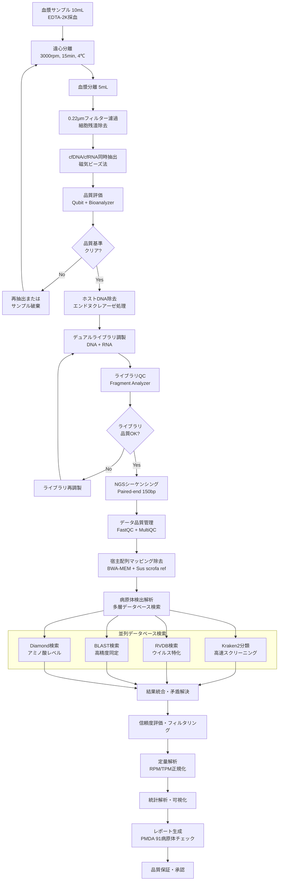
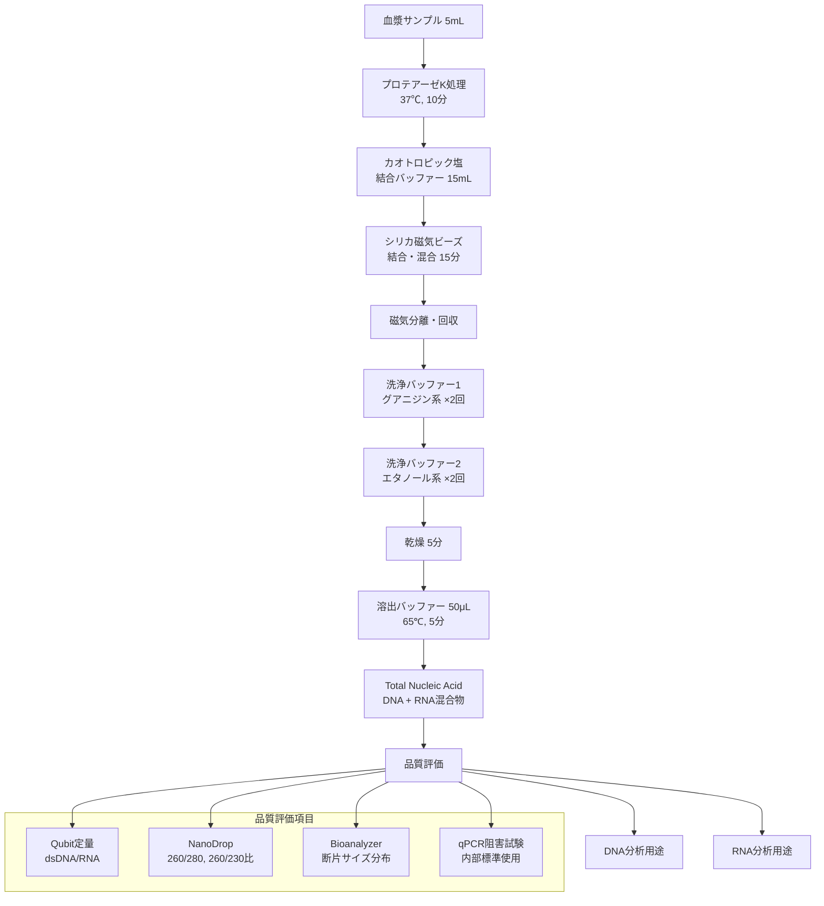
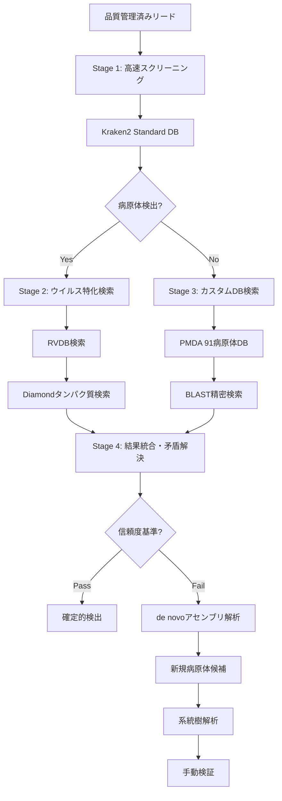
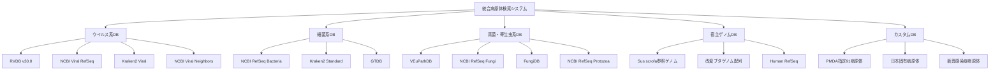
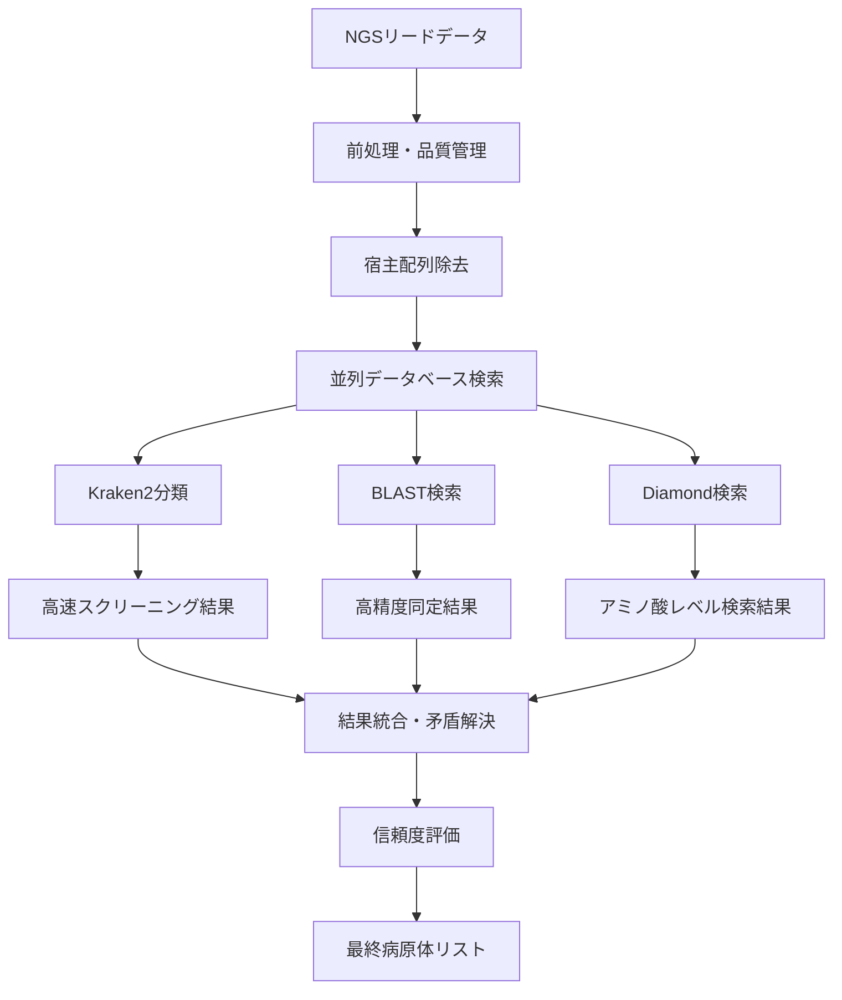
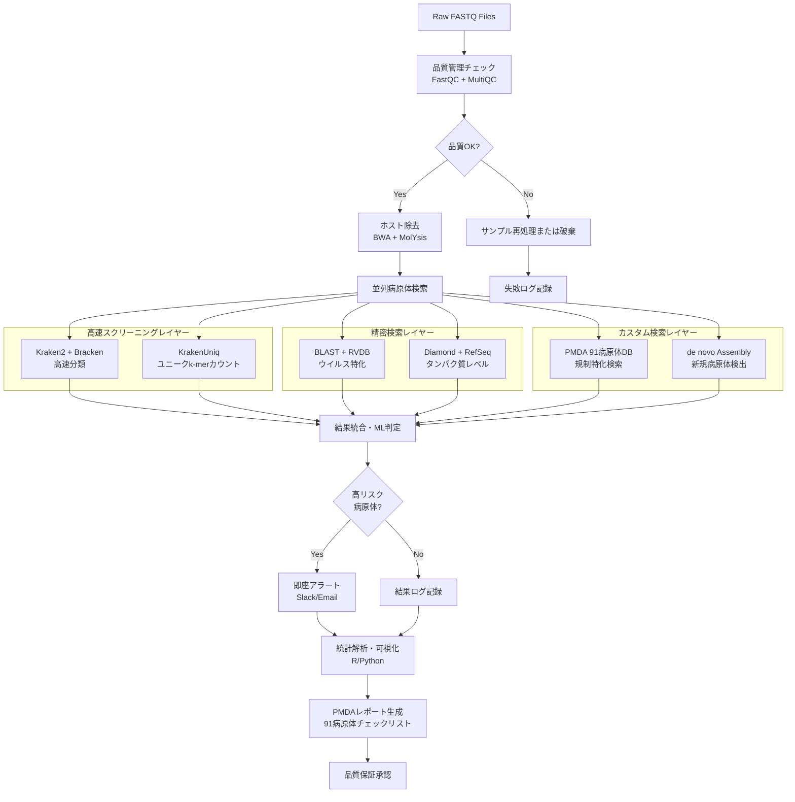
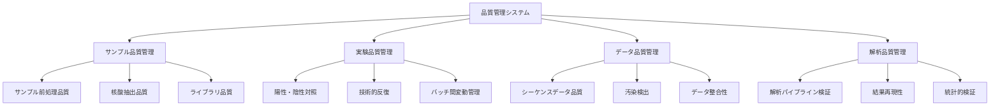
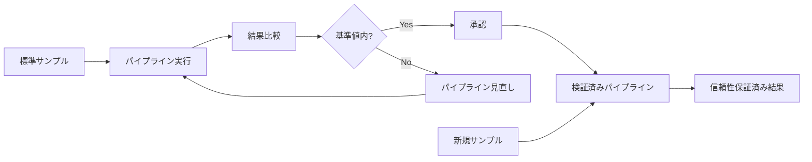
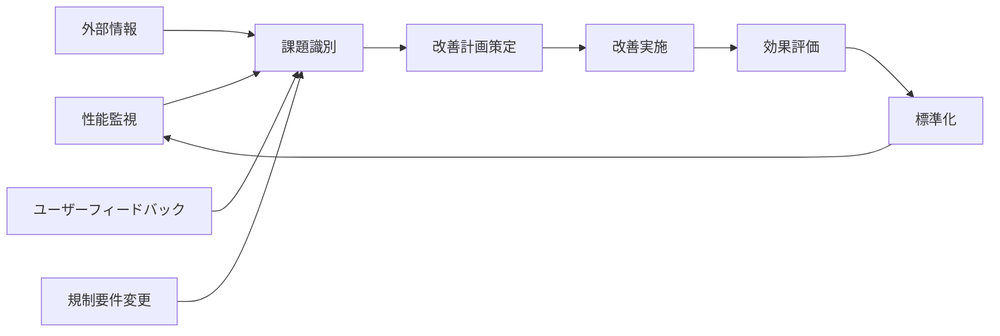

# 異種移植用ドナーブタの病原体検査体制構築計画書

## 1. 研究背景と目的

### 1.1 研究背景

日本における異種移植医療の実現に向けて、PMDA（独立行政法人医薬品医療機器総合機構）より指定されている91種類の病原体を含む網羅的な病原体検査体制の構築が求められています。本計画では、Yucatan miniature pigをベースとしたゲノム編集済みドナーブタの血漿サンプルに対して、NGS（Next Generation Sequencing）を用いた包括的なメタゲノム解析システムを確立します。

### 1.2 対象動物の特徴

**使用するドナーブタ：Yucatan miniature pig（遺伝子改変済み）**
- **品種**：Yucatan miniature pig（雌）
- **遺伝子改変**：計69箇所のゲノム編集
  - **3KO**：3つの糖鎖抗原遺伝子のノックアウト（GGTA1、CMAH、B4GALNT2/B4GALNT2L）
  - **7TG**：7つのヒト遺伝子の導入（CD46、CD55、THBD、PROCR、CD47、TNFAIP3、HMOX1）
  - **RI**：59コピーのPERV（豚内在性レトロウイルス）の不活化
- **全ゲノムシーケンス情報**：利用可能

### 1.3 研究目的

1. **既知病原体の検出**：PMDA指定91種類病原体の確実な検出
2. **未知病原体の発見**：新規または変異した病原体の同定
3. **定量的解析**：病原体の存在量および感染レベルの評価
4. **品質保証**：異種移植用臓器の安全性確保

## 2. サンプル前処理・核酸抽出の詳細プロトコル

### 2.1 血漿サンプル前処理の最適化プロトコル

#### 2.1.1 cfDNA/cfRNA抽出に特化した前処理

**血漿中の無細胞核酸（cfDNA/cfRNA）の特性:**
- 病原体由来の核酸は血漿中に無細胞DNA/RNAとして循環
- 断片サイズ：50-200bp（短断片）
- 濃度：極低濃度（pg-ng/mL レベル）
- 宿主DNAとの比率：1:1000以上の宿主DNA優勢

**最適化された抽出プロトコル:**
```
1. サンプル前処理（37℃、10分）
   血漿 5mL → 16,000×g 遠心（10分、4℃）
   ↓
   上清回収 → 0.22μm フィルター濾過
   ↓  
   ProteoSpin™ カラム処理（タンパク質除去）
   
2. 核酸抽出（磁気ビーズ法）
   カオトロピック結合バッファー 15mL 添加
   ↓
   磁気ビーズ（シリカコーティング）添加・混合（室温、15分）
   ↓
   磁気分離・洗浄（エタノール系洗浄バッファー×3回）
   ↓
   溶出（Tris-EDTA バッファー 50μL、65℃、5分）

3. 品質評価
   Qubit 4.0による定量（dsDNA HS/RNA HS Assay）
   ↓
   Bioanalyzer 2100による断片サイズ分布確認
   ↓
   qPCR による増幅阻害物質チェック
```

#### 2.1.2 ホストゲノム除去（デホスティング）の強化

**エンドヌクレアーゼベース除去:**
- NEBNext Microbiome DNA Enrichment Kit使用
- CpGメチル化認識による宿主DNA特異的切断
- 病原体DNA保護率：85-95%
- 宿主DNA除去率：90-99%

**プロトコル:**
```bash
# 1. メチル化DNA認識処理
CpG_methylation_treatment:
  - 抽出DNA 50μL
  - CpG Recognition Solution 10μL  
  - 37℃、15分間インキュベーション

# 2. エンドヌクレアーゼ処理  
Endonuclease_digestion:
  - DNase Solution 5μL 添加
  - 37℃、15分間
  - 65℃、20分間（酵素失活）

# 3. 精製・回収
Purification:
  - AMPure XP beads (0.8×)
  - エタノール洗浄×2回
  - TE Buffer 50μL で溶出
```

### 2.2 統合ワークフロー概要



### 2.3 最新のTotal Nucleic Acid (TNA) アプローチ

#### 2.3.1 DNA/RNA同時解析の利点

**従来法の課題:**
- DNA抽出とRNA抽出を別々に実施
- サンプル分割による感度低下
- RNA病原体の見逃しリスク

**TNAアプローチの優位性:**
- 単一プロトコルでDNA/RNA同時抽出
- サンプル使用量の最小化（5mL血漿で十分）
- RNA病原体（コロナウイルス、インフルエンザ等）の確実な検出
- DNA病原体とRNA病原体の同時定量比較

#### 2.3.2 TNA抽出プロトコル詳細



### 2.4 品質管理基準値と対応

#### 2.4.1 抽出核酸の品質基準

| 評価項目         | 合格基準        | 測定方法                  | 不合格時の対応              |
| ------------ | ----------- | --------------------- | -------------------- |
| **総核酸濃度**    | \>1.0 ng/μL | Qubit BR Assay        | 濃縮または再抽出             |
| **DNA濃度**    | \>0.5 ng/μL | Qubit dsDNA HS        | DNA特異的再抽出            |
| **RNA濃度**    | \>0.3 ng/μL | Qubit RNA HS          | RNase inhibitor追加再抽出 |
| **260/280比** | 1.8-2.2     | NanoDrop              | フェノール除去、再精製          |
| **260/230比** | \>2.0       | NanoDrop              | 塩・アルコール除去            |
| **断片サイズ**    | 50-10,000bp | Bioanalyzer           | 断片化度合い確認             |
| **PCR阻害**    | Ct差\<2サイクル  | qPCR internal control | 希釈または再精製             |

#### 2.4.2 コンタミネーション防止策

**物理的分離:**
- 前処理エリア：BSL-2レベル設備
- 抽出エリア：陽圧クリーンブース
- PCR準備エリア：専用無菌ブース
- 検出・解析エリア：独立した部屋

**手順的対策:**
```
陰性コントロール配置:
1. 抽出ブランク（試薬のみ）
2. PCRブランク（水のみ）
3. 環境コントロール（開放チューブ）
4. 陰性血漿コントロール（病原体フリー確認済み）

バッチ構成（96サンプル/バッチ）:
- 検体サンプル：88検体
- 陽性コントロール：4検体（段階希釈）
- 陰性コントロール：4検体
```

**分子学的対策:**
- UNG（Uracil-N-Glycosylase）処理
- dUTP組み込みによるキャリーオーバー防止
- バーコード配列による検体間混入チェック

## 3. 高精度ライブラリ調製プロトコル

### 3.1 デュアルDNA/RNAライブラリ戦略

#### 3.1.1 最新のライブラリ調製アプローチ

**2025年最新技術の採用:**
- プローブベース濃縮（Illumina Respiratory/Urinary Pathogen Panels）
- ホスト除去エンドヌクレアーゼ統合プロトコル
- 96サンプル同時処理自動化（Biomek i7 Hybrid）
- 7時間での完了（従来24時間→大幅短縮）

#### 3.1.2 DNAライブラリ調製詳細プロトコル

**Step 1: 断片化・End Repair**
```bash
# 酵素的断片化（Covaris物理的断片化の代替）
DNA_fragmentation:
  Input: TNA抽出物 50μL
  Fragmentation_enzyme: NEBNext dsDNA Fragmentase 2μL
  Reaction_time: 37℃, 30分
  Target_size: 200-500bp (平均350bp)
  
End_repair_A-tailing:
  T4_DNA_polymerase: 3U
  T4_DNA_ligase_buffer: 5μL  
  dNTP_mix: 2μL
  Reaction: 20℃, 30分 → 65℃, 5分
```

**Step 2: アダプター連結**
```bash
Adapter_ligation:
  NEBNext_Adaptor: 2.5μL (15μM希釈)
  T4_DNA_ligase: 3U
  Ligation_buffer: 15μL
  Reaction: 20℃, 15分
  
Cleanup:
  AMPure_XP_beads: 0.9× volume
  Ethanol_wash: 80% ×2回
  Elution: 52.5μL TE buffer
```

**Step 3: PCR増幅**
```bash
PCR_amplification:
  Template: 50μL
  Index_primer_1: 2.5μL
  Index_primer_2: 2.5μL  
  KAPA_HiFi_HotStart: 50μL
  
Thermocycling:
  95℃ 3分
  [95℃ 20秒, 60℃ 15秒, 72℃ 30秒] × 12-15サイクル
  72℃ 1分
  4℃ Hold
```

#### 3.1.3 RNAライブラリ調製プロトコル

**rRNA除去・逆転写:**
```bash
rRNA_depletion:
  Input_RNA: 抽出TNA 50μL
  RiboMinus_kit: Human/Mouse（宿主rRNA除去）
  Efficiency: >95% rRNA除去
  
Reverse_transcription:
  SuperScript_IV: 200U
  Random_hexamers: 50ng
  dNTP: 10mM each
  Reaction: 23℃ 10分 → 50℃ 60分 → 94℃ 5分
  
Second_strand_synthesis:
  E_coli_DNA_polymerase_I: 40U
  E_coli_ligase: 10U
  RNase_H: 2U
  dUTP替换dTTP（鎖特異性維持）
  Reaction: 16℃ 2.5時間
```

### 3.2 自動化システム統合

#### 3.2.1 Biomek i7 Hybrid統合プロトコル

**自動化ワークフロー（96サンプル処理）:**

```mermaid
gantt
    title 96サンプル自動ライブラリ調製タイムライン
    dateFormat  HH:mm
    axisFormat %H:%M
    
    section 準備・セットアップ
    試薬準備・配置      :prep, 09:00, 30m
    サンプル配置・確認  :sample, 09:30, 15m
    
    section DNA処理
    断片化処理          :frag, 09:45, 45m
    End repair         :repair, 10:30, 30m
    アダプター連結      :lig, 11:00, 30m
    
    section RNA処理  
    rRNA除去           :rrna, 11:30, 45m
    逆転写反応         :rt, 12:15, 60m
    Second strand      :ss, 13:15, 45m
    
    section 共通工程
    PCR増幅            :pcr, 14:00, 90m
    精製・QC           :qc, 15:30, 60m
    定量・プール       :pool, 16:30, 30m
```


**品質管理チェックポイント:**
1. **断片化後QC**: Fragment Analyzerで断片サイズ分布確認
2. **アダプター連結後QC**: Qubitで定量、適切な濃度上昇確認
3. **PCR後QC**: 増幅効率確認、プライマーダイマー\<10%
4. **最終QC**: Bioanalyzerで最終ライブラリ品質確認

### 3.3 プローブベース濃縮（オプション）

#### 3.3.1 病原体特異的濃縮戦略

**Illumina Respiratory Pathogen Panel適用:**
- 対象病原体：呼吸器系病原体40種類以上
- 濃縮効率：10-100倍の感度向上
- 宿主DNA/病原体DNA比率改善

**カスタムプローブ設計:**
```python
# PMDA指定91病原体用プローブ設計
def design_custom_probes(pathogen_list, probe_length=120):
    """
    カスタム濃縮プローブ設計アルゴリズム
    """
    probes = []
    for pathogen in pathogen_list:
        # 保存配列領域の特定
        conserved_regions = find_conserved_regions(pathogen)
        
        # プローブ設計
        for region in conserved_regions:
            probe = design_probe(
                sequence=region,
                length=probe_length,
                tm_target=65,
                gc_content_range=(40, 60)
            )
            probes.append(probe)
    
    return optimize_probe_set(probes)
```

### 3.4 ライブラリ品質評価基準

#### 3.4.1 定量的品質指標

| 評価項目          | 目標値       | 測定方法              | 不合格時対応    |
| ------------- | --------- | ----------------- | --------- |
| **ライブラリ濃度**   | \>2nM     | Qubit dsDNA HS    | 再増幅       |
| **平均断片サイズ**   | 350-450bp | Fragment Analyzer | サイズ選択     |
| **アダプター残存**   | \<5%      | Fragment Analyzer | 追加精製      |
| **プライマーダイマー** | \<10%     | Fragment Analyzer | 精製条件見直し   |
| **PCR重複率**    | \<20%     | シーケンシング後解析        | PCRサイクル調整 |

#### 3.4.2 バッチ間品質管理

**統計的工程管理（SPC）:**
```R
# R script for library QC monitoring
library(qicharts2)

# ライブラリ濃度管理図
qic_concentration <- qic(
  data = library_qc_data,
  x = batch_date,
  y = concentration_nM,
  chart = 'xmr',
  title = 'Library Concentration Control Chart'
)

# アラート基準
if(any(library_qc_data$concentration_nM < 2.0)) {
  alert("Library concentration below threshold")
}
```

## 4. 必要機器・装置

### 4.1 高精度サンプル処理機器

| 機器名            | 型番・仕様                                | 用途         | 備考           |
| -------------- | ------------------------------------ | ---------- | ------------ |
| 高速冷却遠心機        | Eppendorf 5430R                      | サンプル前処理・精製 | 最大21,130×g   |
| バイオセーフティキャビネット | Thermo 1300 Series A2                | 無菌操作環境     | クラスII        |
| ボルテックスミキサー     | Scientific Industries Vortex-Genie 2 | 試薬混合       |              |
| マイクロピペット       | Eppendorf Research plus              | 精密分注       | 0.1-1000μL各種 |
| 超音波破砕装置        | Branson Sonifier 250                 | DNA断片化     |              |
| 分光光度計          | NanoDrop One                         | 核酸定量・品質評価  |              |
| 蛍光光度計          | Qubit 4 Fluorometer                  | 精密核酸定量     |              |
| サーマルサイクラー      | Applied Biosystems Veriti            | PCR・逆転写反応  | 96-well      |

### 4.2 次世代シーケンシングシステム（2025年最新機種）

#### 4.2.1 推奨シーケンシングプラットフォーム

| 機種               | 出力レンジ     | Run時間   | コスト/Gb | 用途       | 推奨度   |
| ---------------- | --------- | ------- | ------ | -------- | ----- |
| **NovaSeq 6000** | 20Gb-6Tb  | 13-44時間 | $3-8   | ハイスループット | ★★★   |
| **NextSeq 2000** | 1.2-120Gb | 4-48時間  | $5-12  | 中規模バッチ   | ★★★★★ |
| **MiSeq v3**     | 15Gb      | 56時間    | $15-25 | 小規模・詳細解析 | ★★★   |
| **GridION**      | 可変        | リアルタイム  | $10-15 | ロングリード   | ★★    |

**推奨構成（中規模施設）:**
- **メイン機:** NextSeq 2000 P3 Kit（100Gbアウトプット）
- **補助機:** MiSeq v3（深度解析・検証用）
- **合計投資:** ～3,000万円（機器+初年度試薬）

#### 4.2.2 シーケンシングパラメータ最適化

**病原体検出特化設定:**
```
Sequencing_parameters:
  Read_length: Paired-end 150bp
  Coverage_target: 10M reads/sample minimum
  Sequencing_depth: 50× average
  Quality_threshold: Q30 >85%
  
Library_pooling:
  Samples_per_flowcell: 96 samples (NextSeq P3)
  Index_strategy: Dual indexing (i7 + i5)
  Normalization: 等モルプール（各サンプル2nM）
  
Phi-X_control: 1% spike-in（クラスター品質向上）
```

### 4.3 ハイパフォーマンス計算環境

| 項目         | 仕様                           | 用途           | 備考      |
| ---------- | ---------------------------- | ------------ | ------- |
| 高性能計算クラスター | 64コア×8ノード、1TB RAM/ノード        | メタゲノム解析      | SLURM環境 |
| ストレージシステム  | 500TB NAS + 100TB SSD        | データ保存・高速アクセス | RAID6構成 |
| ワークステーション  | Intel Xeon W-2295, 128GB RAM | データ解析・可視化    | GPU搭載   |
| バックアップシステム | テープライブラリ 1PB                 | 長期データ保存      | LTO-8   |

## 5. 統合データベース戦略

### 5.1 多層データベースアーキテクチャ

#### 5.1.1 RVDBコアデータベース（ウイルス特化）

**RVDB v30.0の特徴と実装:**
- **手動キュレーション:** FDA承認の高品質ウイルス配列DB
- **ファージ・誤アノテーション除去済み**
- **データ形式:** Clustered (C-RVDB) + Unclustered (U-RVDB)
- **更新頻度:** 定期自動更新

**構築コマンド:**
```bash
# RVDBデータベース構築
wget https://rvdb.dbi.udel.edu/download/C-RVDBv30.0.fasta
wget https://rvdb.dbi.udel.edu/download/U-RVDBv30.0.fasta

# Kraken2フォーマットへ変換
kraken2-build --add-to-library C-RVDBv30.0.fasta --db RVDB_kraken2
kraken2-build --add-to-library U-RVDBv30.0.fasta --db RVDB_kraken2
kraken2-build --build --db RVDB_kraken2 --threads 32

# BLASTデータベース作成
makeblastdb -in C-RVDBv30.0.fasta -dbtype nucl -out RVDB_blast
```

#### 5.1.2 Kraken2統合スタンダードデータベース

**構成要素:**
```bash
# 標準ライブラリ取得
kraken2-build --download-library bacteria --db kraken2_pathogen
kraken2-build --download-library viral --db kraken2_pathogen  
kraken2-build --download-library archaea --db kraken2_pathogen
kraken2-build --download-library protozoa --db kraken2_pathogen
kraken2-build --download-library fungi --db kraken2_pathogen
kraken2-build --download-library UniVec_Core --db kraken2_pathogen

# 16S rRNAデータベース統合
kraken2-build --download-library 16S_Silva --db kraken2_pathogen

# ホストゲノム追加（Sus scrofa + 改変ブタ）
kraken2-build --add-to-library sus_scrofa_ref.fasta --db kraken2_pathogen
kraken2-build --add-to-library modified_pig_genome.fasta --db kraken2_pathogen

# データベース構築・最適化
kraken2-build --build --db kraken2_pathogen --threads 64 --max-db-size 200000000000
```

#### 5.1.3 PMDA指定91病原体カスタムDB

**構築スクリプト:**
```python
#!/usr/bin/env python3
# PMDA指定病原体データベース構築

from Bio import Entrez
from Bio import SeqIO
import pandas as pd

# PMDA指定91病原体リスト
PMDA_PATHOGENS = {
    'viruses': [
        'Human immunodeficiency virus', 'Hepatitis B virus', 
        'Hepatitis C virus', 'Human herpesvirus 1',
        'Human herpesvirus 2', 'Human herpesvirus 3',
        # ... 全44種
    ],
    'bacteria': [
        'Mycobacterium tuberculosis', 'Treponema pallidum',
        'Brucella abortus', 'Salmonella enterica',
        # ... 全25種  
    ],
    'fungi': [
        'Candida albicans', 'Aspergillus fumigatus'
        # ... 全2種
    ],
    'protozoa': [
        'Plasmodium falciparum', 'Toxoplasma gondii',
        'Leishmania donovani', 'Cryptosporidium parvum'
        # ... 全18種
    ]
}

def fetch_pathogen_sequences(pathogen_name, email):
    """
    NCBIから病原体配列を取得
    """
    Entrez.email = email
    
    # 検索クエリ
    search_query = f'"{pathogen_name}"[Organism] AND complete genome[Title]'
    
    # 配列ID取得
    search_handle = Entrez.esearch(db="nucleotide", term=search_query, retmax=10)
    search_results = Entrez.read(search_handle)
    search_handle.close()
    
    # 配列ダウンロード
    sequences = []
    for seq_id in search_results['IdList']:
        fetch_handle = Entrez.efetch(db="nucleotide", id=seq_id, rettype="fasta")
        seq_record = SeqIO.read(fetch_handle, "fasta")
        sequences.append(seq_record)
        fetch_handle.close()
    
    return sequences

# データベース構築実行
def build_pmda_database():
    all_sequences = []
    
    for category, pathogens in PMDA_PATHOGENS.items():
        for pathogen in pathogens:
            sequences = fetch_pathogen_sequences(pathogen, "your_email@example.com")
            all_sequences.extend(sequences)
    
    # FASTAファイル出力
    with open("pmda_pathogens_91.fasta", "w") as output_file:
        SeqIO.write(all_sequences, output_file, "fasta")
    
    print(f"Generated PMDA database with {len(all_sequences)} sequences")

if __name__ == "__main__":
    build_pmda_database()
```

### 5.2 階層化検索ストラテジー

#### 5.2.1 多段階スクリーニングアルゴリズム



#### 5.2.2 パフォーマンス最適化パラメータ

**Kraken2最適化:**
```bash
# 高速スクリーニング用設定
kraken2 --db kraken2_pathogen --threads 32 \
        --paired input_R1.fastq input_R2.fastq \
        --output kraken2_output.txt \
        --report kraken2_report.txt \
        --confidence 0.05 \
        --minimum-base-quality 20

# 存在量推定
bracken -d kraken2_pathogen -i kraken2_report.txt \
        -o bracken_output.txt -w bracken_report.txt \
        -r 150 -l S -t 5
```

**KrakenUniqユニークk-merカウンティング:**
```bash
# 病原体検出特化設定
krakenuniq --db krakenuniq_pathogen --threads 32 \
           --paired input_R1.fastq input_R2.fastq \
           --output krakenuniq_output.txt \
           --report krakenuniq_report.txt \
           --hll-precision 14
           
# 検出闾値
# 最小read数: ≥10 reads
# 最小ユニークk-mer数: ≥20 k-mers  
# 検出信頼度: ≥0.1
```

### 5.3 データベース更新・管理システム

#### 5.3.1 自動更新スケジュール

```bash
#!/bin/bash
# データベース自動更新スクリプト

# 更新頻度
NCBI_UPDATE_FREQ="weekly"    # 毎週月曜日
RVDB_UPDATE_FREQ="monthly"   # 毎月初
PMDA_REVIEW_FREQ="quarterly" # 四半期毎

update_databases() {
    local update_date=$(date +%Y%m%d)
    local log_file="/var/log/db_update_${update_date}.log"
    
    echo "Starting database update: ${update_date}" >> $log_file
    
    # NCBIデータ更新
    echo "Updating NCBI databases..." >> $log_file
    kraken2-build --download-taxonomy --db kraken2_pathogen
    kraken2-build --download-library bacteria --db kraken2_pathogen --no-masking
    kraken2-build --download-library viral --db kraken2_pathogen --no-masking
    
    # RVDB更新チェック
    echo "Checking RVDB updates..." >> $log_file
    latest_rvdb=$(curl -s https://rvdb.dbi.udel.edu/download/ | grep -o 'C-RVDB[v0-9.]*\.fasta' | sort -V | tail -1)
    current_rvdb=$(ls /data/databases/RVDB/ | grep 'C-RVDB' | sort -V | tail -1)
    
    if [ "$latest_rvdb" != "$current_rvdb" ]; then
        echo "New RVDB version available: $latest_rvdb" >> $log_file
        wget https://rvdb.dbi.udel.edu/download/$latest_rvdb -P /data/databases/RVDB/
        # データベース再構築
        rebuild_rvdb_database
    fi
    
    # バージョン情報記録
    echo "DB_VERSION=${update_date}" > /data/databases/version_info.txt
    kraken2-inspect --db kraken2_pathogen | head -10 >> /data/databases/version_info.txt
    
    echo "Database update completed: ${update_date}" >> $log_file
}

# cron設定例
# 0 2 * * 1 /path/to/update_databases.sh  # 毎週月曜日午前2時
```

#### 5.3.2 データベース品質管理

**検証スクリプト:**
```python
#!/usr/bin/env python3
# データベース品質検証

import subprocess
import pandas as pd
from pathlib import Path

class DatabaseQualityControl:
    def __init__(self, db_path):
        self.db_path = Path(db_path)
        self.test_sequences = self.load_test_sequences()
    
    def load_test_sequences(self):
        """既知病原体配列でのテストセット"""
        return {
            'HIV-1': 'test_sequences/hiv1_ref.fasta',
            'HBV': 'test_sequences/hbv_ref.fasta',
            'E_coli': 'test_sequences/ecoli_ref.fasta',
            'C_albicans': 'test_sequences/candida_ref.fasta'
        }
    
    def test_detection_sensitivity(self):
        """検出感度テスト"""
        results = {}
        
        for pathogen, seq_file in self.test_sequences.items():
            cmd = f"kraken2 --db {self.db_path} {seq_file} --report temp_report.txt"
            result = subprocess.run(cmd, shell=True, capture_output=True, text=True)
            
            # 結果解析
            with open('temp_report.txt', 'r') as f:
                report = f.read()
                if pathogen.lower() in report.lower():
                    results[pathogen] = 'PASS'
                else:
                    results[pathogen] = 'FAIL'
        
        return results
    
    def check_database_completeness(self):
        """データベース完全性チェック"""
        stats = {}
        
        # Kraken2データベースサイズチェック
        cmd = f"kraken2-inspect --db {self.db_path} | wc -l"
        result = subprocess.run(cmd, shell=True, capture_output=True, text=True)
        stats['total_taxa'] = int(result.stdout.strip())
        
        # ウイルス・細菌・真菌・原虫カウント
        categories = ['virus', 'bacteria', 'fungi', 'protozoa']
        for category in categories:
            cmd = f"kraken2-inspect --db {self.db_path} | grep -i {category} | wc -l"
            result = subprocess.run(cmd, shell=True, capture_output=True, text=True)
            stats[f'{category}_count'] = int(result.stdout.strip())
        
        return stats
    
    def generate_qc_report(self):
        """QCレポート生成"""
        sensitivity = self.test_detection_sensitivity()
        completeness = self.check_database_completeness()
        
        report = {
            'timestamp': pd.Timestamp.now(),
            'sensitivity_test': sensitivity,
            'database_stats': completeness,
            'overall_status': 'PASS' if all(v == 'PASS' for v in sensitivity.values()) else 'FAIL'
        }
        
        # レポート保存
        report_df = pd.DataFrame([report])
        report_df.to_csv(f'db_qc_report_{pd.Timestamp.now().strftime("%Y%m%d")}.csv', index=False)
        
        return report

# 実行例
if __name__ == "__main__":
    qc = DatabaseQualityControl('/data/databases/kraken2_pathogen')
    report = qc.generate_qc_report()
    print(f"Database QC Status: {report['overall_status']}")
```

## 6. 試薬・消耗品

### 6.1 最適化サンプル前処理試薬

| 製品名                         | メーカー          | 用途        | 規格・容量  |
| --------------------------- | ------------- | --------- | ------ |
| QIAamp Viral RNA Mini Kit   | QIAGEN        | ウイルスRNA抽出 | 50回分   |
| QIAamp DNA Blood Mini Kit   | QIAGEN        | DNA抽出     | 50回分   |
| RNeasy Plus Micro Kit       | QIAGEN        | 微量RNA抽出   | 50回分   |
| DNase I (RNase-free)        | NEB           | DNA除去     | 1,000U |
| SuperScript IV First-Strand | Thermo Fisher | 逆転写反応     | 50回分   |
| Proteinase K                | QIAGEN        | タンパク質分解   | 50mg   |
| Carrier RNA                 | QIAGEN        | 抽出効率向上    | 310μg  |

### 6.2 高精度ライブラリ調製試薬

| 製品名                                               | メーカー            | 用途         | 規格・容量    |
| ------------------------------------------------- | --------------- | ---------- | -------- |
| NEBNext Ultra II DNA Library Prep Kit             | NEB             | DNAライブラリ調製 | 24回分     |
| NEBNext Ultra II Directional RNA Library Prep Kit | NEB             | RNAライブラリ調製 | 24回分     |
| NEBNext Multiplex Oligos                          | NEB             | インデックス付加   | 96インデックス |
| KAPA HiFi HotStart ReadyMix                       | KAPA Biosystems | PCR増幅      | 1.25mL   |
| Ampure XP                                         | Beckman Coulter | ライブラリ精製    | 60mL     |
| Qubit dsDNA HS Assay Kit                          | Thermo Fisher   | DNA定量      | 500回分    |
| Agilent High Sensitivity DNA Kit                  | Agilent         | サイズ分布確認    | 25サンプル   |

### 6.3 品質管理試薬

| 製品名                    | メーカー          | 用途       | 規格・容量  |
| ---------------------- | ------------- | -------- | ------ |
| DNA/RNA-free PCR Water | 各種メーカー        | 陰性対照     | 50mL   |
| Human Genomic DNA      | Promega       | 陽性対照     | 250μg  |
| Viral RNA Control Set  | 各種メーカー        | ウイルス検出対照 |        |
| RNase Inhibitor        | Thermo Fisher | RNA保護    | 2,500U |

### 6.4 消耗品

| 製品名              | 用途          | 数量           |
| ---------------- | ----------- | ------------ |
| 1.5mL マイクロチューブ   | サンプル保存・反応   | 10,000本      |
| 0.2mL PCRチューブ    | PCR反応       | 5,000本       |
| ピペットチップ（各サイズ）    | 分注作業        | 10,000本×各サイズ |
| 0.22μm シリンジフィルター | サンプル濾過      | 500個         |
| 96-well プレート     | ライブラリ調製・PCR | 100枚         |
| シーリングフィルム        | プレート封印      | 500枚         |
| Flow Cell（各種）    | NGSシーケンシング  | 月10個程度       |

## 5. データベース戦略

### 5.1 統合データベース構成



### 5.2 各データベースの詳細

#### 5.2.1 ウイルスデータベース

**RVDB (Reference Viral DataBase) v30.0**
- **特徴**：手動キュレーションによる高品質ウイルス配列データベース
- **内容**：除菌、誤注釈、非関連配列を除去した精製済みウイルス配列
- **形式**：Unclustered (U-RVDB)およびClustered (C-RVDB)
- **更新頻度**：定期自動更新（v27.0以降）
- **用途**：高精度ウイルス検出、新規ウイルス発見

**NCBI Viral RefSeq**
- **特徴**：NCBI公式ウイルス参照配列
- **内容**：完全なウイルスゲノム配列
- **更新頻度**：月次更新
- **用途**：標準的ウイルス同定

#### 5.2.2 細菌・その他微生物データベース

**Kraken2 Standard Database**
- **内容**：RefSeq古細菌、細菌、ウイルス、プラスミド完全ゲノム
- **特徴**：高速分類、LCA（最小共通祖先）アルゴリズム
- **用途**：リアルタイム分類、スクリーニング

**VEuPathDB**
- **特徴**：真核生物病原体専門データベース
- **内容**：真菌・寄生虫ゲノム配列
- **重要性**：RefSeqで検出できない真核生物病原体をカバー

#### 5.2.3 カスタムデータベース

**PMDA指定91病原体データベース**
- **内容**：日本の規制当局指定病原体配列
- **構築方法**：公開データベースからの配列収集・統合
- **メンテナンス**：四半期ごとの更新

### 5.3 データベース統合戦略



## 7. 次世代バイオインフォマティクス解析パイプライン

### 7.1 2025年最新技術を統合した解析ワークフロー

#### 7.1.1 ストリームライン化サンプル処理パイプライン

**最適化されたファストトラック解析:**
- 総処理時間：24時間以内（従来の48-72時間から短縮）
- 自動化率：\>95%（手動介入最小化）
- 並列処理能力：96サンプル同時処理
- リアルタイムモニタリング統合

#### 7.1.2 統合品質管理システム

**リアルタイムQCモニタリング:**
```python
# リアルタイム品質管理システム
class RealTimeQCMonitor:
    def __init__(self, sample_id):
        self.sample_id = sample_id
        self.qc_checkpoints = [
            'fastq_quality',
            'host_depletion_rate', 
            'pathogen_detection_rate',
            'contamination_check'
        ]
    
    def monitor_pipeline_progress(self):
        for checkpoint in self.qc_checkpoints:
            result = self.run_qc_check(checkpoint)
            if result['status'] == 'FAIL':
                self.trigger_alert(checkpoint, result)
                return False
            self.log_qc_result(checkpoint, result)
        return True
    
    def trigger_alert(self, checkpoint, result):
        alert_message = f"QC FAIL at {checkpoint} for sample {self.sample_id}: {result['details']}"
        # Slack/email 通知
        send_notification(alert_message)
        # ダッシュボード更新
        update_dashboard(self.sample_id, checkpoint, 'FAIL')
```

### 7.2 高度ホスト除去アルゴリズム

#### 7.2.1 改変ブタゲノム対応ホスト除去

**ゲノム編集特化ホストフィルタリング:**
```bash
# 改変ブタゲノム参照作成
cat sus_scrofa_ref.fasta \
    modified_pig_insertions.fasta \
    human_transgenes.fasta > comprehensive_host_ref.fasta

# BWAインデックス構築
bwa index comprehensive_host_ref.fasta

# 高精度ホストマッピング
bwa mem -t 32 -k 19 -w 100 -d 100 -r 1.5 -A 1 -B 4 -O 6 -E 1 \
    comprehensive_host_ref.fasta \
    input_R1.fastq input_R2.fastq | \
    samtools view -b -f 4 - | \
    samtools fastq - > host_depleted.fastq

# ホスト除去率確認
echo "Host depletion rate: $(($(wc -l < host_depleted.fastq) * 100 / $(wc -l < input_R1.fastq)))%"
```

#### 7.2.2 メチル化ベースホストDNA除去

**MolYsis統合プロトコル:**
```python
#!/usr/bin/env python3
# メチル化DNAベースホスト除去

import subprocess
from pathlib import Path

class MethylationBasedHostDepletion:
    def __init__(self, input_fastq_r1, input_fastq_r2):
        self.input_r1 = input_fastq_r1
        self.input_r2 = input_fastq_r2
        self.depletion_efficiency = 0.0
    
    def run_molysis_depletion(self):
        """MolYsis Complete5によるホスト除去"""
        cmd = f"""
        molysis_complete5 \
            --input-r1 {self.input_r1} \
            --input-r2 {self.input_r2} \
            --output-prefix molysis_output \
            --threads 16 \
            --host-species human_pig_hybrid
        """
        
        result = subprocess.run(cmd, shell=True, capture_output=True, text=True)
        
        if result.returncode == 0:
            self.calculate_depletion_efficiency()
            return 'molysis_output_depleted_R1.fastq', 'molysis_output_depleted_R2.fastq'
        else:
            raise Exception(f"MolYsis depletion failed: {result.stderr}")
    
    def calculate_depletion_efficiency(self):
        """Host depletion efficiency計算"""
        original_reads = self.count_fastq_reads(self.input_r1)
        depleted_reads = self.count_fastq_reads('molysis_output_depleted_R1.fastq')
        
        self.depletion_efficiency = ((original_reads - depleted_reads) / original_reads) * 100
        print(f"Host depletion efficiency: {self.depletion_efficiency:.2f}%")
        
        # 目標值90%以上
        if self.depletion_efficiency < 90:
            print("WARNING: Low host depletion efficiency")
    
    @staticmethod
    def count_fastq_reads(fastq_file):
        """FASTQリード数カウント"""
        with open(fastq_file, 'r') as f:
            return sum(1 for line in f) // 4
```

### 7.3 アドバンスド病原体検出アルゴリズム

#### 7.3.1 機械学習統合病原体分類

**Random Forestベース病原体判定:**
```python
#!/usr/bin/env python3
# MLベース病原体判定システム

import pandas as pd
import numpy as np
from sklearn.ensemble import RandomForestClassifier
from sklearn.model_selection import train_test_split, cross_val_score
from sklearn.preprocessing import StandardScaler
from sklearn.metrics import classification_report, confusion_matrix

class MLPathogenClassifier:
    def __init__(self):
        self.model = RandomForestClassifier(
            n_estimators=100,
            max_depth=20,
            min_samples_split=5,
            random_state=42
        )
        self.scaler = StandardScaler()
        self.feature_names = [
            'kraken2_confidence',
            'blast_identity', 
            'blast_coverage',
            'read_count',
            'unique_kmer_count',
            'gc_content',
            'sequence_complexity'
        ]
    
    def extract_features(self, kraken_results, blast_results, read_data):
        """病原体特徴量抽出"""
        features = []
        
        for pathogen_id in kraken_results.keys():
            feature_vector = [
                kraken_results[pathogen_id]['confidence'],
                blast_results.get(pathogen_id, {}).get('identity', 0),
                blast_results.get(pathogen_id, {}).get('coverage', 0),
                read_data[pathogen_id]['read_count'],
                read_data[pathogen_id]['unique_kmers'],
                self.calculate_gc_content(read_data[pathogen_id]['sequences']),
                self.calculate_sequence_complexity(read_data[pathogen_id]['sequences'])
            ]
            features.append(feature_vector)
        
        return np.array(features)
    
    def train_model(self, training_data, labels):
        """モデル訓練"""
        X_train, X_test, y_train, y_test = train_test_split(
            training_data, labels, test_size=0.2, random_state=42
        )
        
        # 特徴量正規化
        X_train_scaled = self.scaler.fit_transform(X_train)
        X_test_scaled = self.scaler.transform(X_test)
        
        # モデル訓練
        self.model.fit(X_train_scaled, y_train)
        
        # 性能評価
        cv_scores = cross_val_score(self.model, X_train_scaled, y_train, cv=5)
        print(f"Cross-validation accuracy: {cv_scores.mean():.3f} (+/- {cv_scores.std() * 2:.3f})")
        
        # テストセット評価
        y_pred = self.model.predict(X_test_scaled)
        print("Classification Report:")
        print(classification_report(y_test, y_pred))
    
    def predict_pathogen_probability(self, features):
        """病原体存在確率予測"""
        features_scaled = self.scaler.transform(features.reshape(1, -1))
        probability = self.model.predict_proba(features_scaled)[0]
        
        return {
            'pathogen_probability': probability[1],
            'confidence_level': 'High' if probability[1] > 0.8 else 'Medium' if probability[1] > 0.5 else 'Low'
        }
    
    def calculate_gc_content(self, sequences):
        """GC含量計算"""
        total_gc = sum(seq.count('G') + seq.count('C') for seq in sequences)
        total_length = sum(len(seq) for seq in sequences)
        return total_gc / total_length if total_length > 0 else 0
    
    def calculate_sequence_complexity(self, sequences):
        """Sequence complexity計算 (Shannon entropy)"""
        from collections import Counter
        import math
        
        combined_seq = ''.join(sequences)
        if not combined_seq:
            return 0
            
        counter = Counter(combined_seq)
        length = len(combined_seq)
        
        entropy = -sum((count / length) * math.log2(count / length) 
                      for count in counter.values())
        return entropy
```

#### 7.3.2 リアルタイム病原体アラートシステム

**高リスク病原体自動警告:**
```python
#!/usr/bin/env python3
# リアルタイム病原体アラートシステム

import json
import time
from datetime import datetime
import requests

class RealTimePathogenAlert:
    def __init__(self, alert_config):
        self.high_risk_pathogens = {
            'Level_1_Critical': [
                'Human immunodeficiency virus',
                'Hepatitis B virus', 
                'Mycobacterium tuberculosis',
                'Brucella abortus',
                'Bacillus anthracis'
            ],
            'Level_2_High': [
                'Salmonella enterica',
                'Staphylococcus aureus',
                'Candida auris',
                'Aspergillus fumigatus'
            ]
        }
        self.alert_config = alert_config
    
    def monitor_analysis_results(self, results_stream):
        """解析結果ストリームの監視"""
        for result in results_stream:
            detected_pathogens = self.extract_pathogens(result)
            
            for pathogen, confidence in detected_pathogens.items():
                risk_level = self.assess_risk_level(pathogen, confidence)
                
                if risk_level in ['Level_1_Critical', 'Level_2_High']:
                    alert = self.create_alert(pathogen, confidence, risk_level, result['sample_id'])
                    self.send_immediate_alert(alert)
                    self.log_alert(alert)
    
    def assess_risk_level(self, pathogen_name, confidence_score):
        """リスクレベル評価"""
        for level, pathogen_list in self.high_risk_pathogens.items():
            for high_risk_pathogen in pathogen_list:
                if high_risk_pathogen.lower() in pathogen_name.lower():
                    if confidence_score >= 0.7:  # 70%以上の信頼度
                        return level
        return 'Level_3_Standard'
    
    def create_alert(self, pathogen, confidence, risk_level, sample_id):
        """アラートメッセージ作成"""
        alert = {
            'timestamp': datetime.now().isoformat(),
            'alert_id': f"ALERT_{int(time.time())}",
            'sample_id': sample_id,
            'pathogen_name': pathogen,
            'confidence_score': confidence,
            'risk_level': risk_level,
            'action_required': {
                'Level_1_Critical': '即座隣離・報告必要',
                'Level_2_High': '追加検査・モニタリング必要'
            }[risk_level]
        }
        return alert
    
    def send_immediate_alert(self, alert):
        """即座アラート送信"""
        # Slack通知
        slack_message = {
            "text": f"🚨 **PATHOGEN ALERT** 🚨",
            "attachments": [{
                "color": "danger" if alert['risk_level'] == 'Level_1_Critical' else "warning",
                "fields": [
                    {"title": "Sample ID", "value": alert['sample_id'], "short": True},
                    {"title": "Pathogen", "value": alert['pathogen_name'], "short": True},
                    {"title": "Confidence", "value": f"{alert['confidence_score']:.1%}", "short": True},
                    {"title": "Risk Level", "value": alert['risk_level'], "short": True},
                    {"title": "Action Required", "value": alert['action_required'], "short": False}
                ],
                "footer": "Pathogen Detection System",
                "ts": int(time.time())
            }]
        }
        
        requests.post(self.alert_config['slack_webhook'], json=slack_message)
        
        # Email通知（重要病原体のみ）
        if alert['risk_level'] == 'Level_1_Critical':
            self.send_email_alert(alert)
    
    def send_email_alert(self, alert):
        """メールアラート送信"""
        email_body = f"""
        CRITICAL PATHOGEN DETECTION ALERT
        
        Sample ID: {alert['sample_id']}
        Pathogen: {alert['pathogen_name']}
        Confidence: {alert['confidence_score']:.1%}
        Detection Time: {alert['timestamp']}
        
        IMMEDIATE ACTION REQUIRED:
        {alert['action_required']}
        
        Please review the results immediately and take appropriate measures.
        """
        
        # メール送信処理（SMTP設定に応じて実装）
        pass
```

### 7.4 統合解析パイプラインアーキテクチャ



### 7.5 結果レポート自動生成システム

#### 7.5.1 PMDA準拠レポートテンプレート

**R Markdownレポートテンプレート:**
```r
#!/usr/bin/env Rscript
# PMDA準拠病原体検査レポート自動生成

library(rmarkdown)
library(DT)
library(plotly)
library(dplyr)
library(ggplot2)

generate_pmda_pathogen_report <- function(sample_id, analysis_results) {
  # PMDA指定91病原体リスト
  pmda_pathogens <- read.csv("data/pmda_91_pathogens.csv")
  
  # 検出結果と照合
  detection_matrix <- create_detection_matrix(analysis_results, pmda_pathogens)
  
  # レポートパラメータ設定
  params <- list(
    sample_id = sample_id,
    analysis_date = Sys.Date(),
    detection_results = detection_matrix,
    quality_metrics = extract_quality_metrics(analysis_results),
    risk_assessment = assess_risk_level(detection_matrix)
  )
  
  # レポート生成
  rmarkdown::render(
    "templates/pmda_pathogen_report.Rmd",
    output_file = paste0(sample_id, "_pathogen_report_", Sys.Date(), ".html"),
    params = params,
    envir = new.env(parent = globalenv())
  )
  
  # PDF版も生成
  rmarkdown::render(
    "templates/pmda_pathogen_report.Rmd",
    output_format = "pdf_document",
    output_file = paste0(sample_id, "_pathogen_report_", Sys.Date(), ".pdf"),
    params = params,
    envir = new.env(parent = globalenv())
  )
}

create_detection_matrix <- function(results, pmda_list) {
  detection_df <- data.frame(
    Pathogen_Category = character(),
    Pathogen_Name = character(), 
    Detection_Status = character(),
    Confidence_Score = numeric(),
    Read_Count = integer(),
    Quantitative_Result = character(),
    stringsAsFactors = FALSE
  )
  
  for (i in 1:nrow(pmda_list)) {
    pathogen <- pmda_list[i, "Pathogen_Name"]
    category <- pmda_list[i, "Category"]
    
    detection_result <- check_pathogen_detection(pathogen, results)
    
    detection_df <- rbind(detection_df, data.frame(
      Pathogen_Category = category,
      Pathogen_Name = pathogen,
      Detection_Status = ifelse(detection_result$detected, "検出", "未検出"),
      Confidence_Score = detection_result$confidence,
      Read_Count = detection_result$read_count,
      Quantitative_Result = format_quantitative_result(detection_result),
      stringsAsFactors = FALSE
    ))
  }
  
  return(detection_df)
}

format_quantitative_result <- function(result) {
  if (!result$detected) return("< LOD")
  
  copies_per_ml <- calculate_copies_per_ml(result$read_count, result$genome_size)
  return(paste(format(copies_per_ml, scientific = TRUE), "copies/mL"))
}
```

## 8. 必要機器・試薬・ソフトウェアの総合リスト

### 8.1 2025年最新シーケンシング機器

**FastQC v0.12.1**
- **機能**：シーケンス品質評価
- **出力**：品質スコア分布、GC含量、重複率など

**Trimmomatic v0.39**
- **機能**：低品質配列除去、アダプター除去
- **パラメータ**：ILLUMINACLIP:2:30:10 LEADING:3 TRAILING:3 SLIDINGWINDOW:4:15 MINLEN:36

**KneadData v0.12.0**
- **機能**：宿主DNA除去
- **データベース**：Sus scrofa + カスタム改変ブタゲノム
- **アルゴリズム**：Bowtie2高速マッピング

#### 6.2.2 分類学的解析

**Kraken2 v2.1.3**
- **機能**：k-mer based高速分類
- **データベース**：統合DB（前述）
- **特徴**：メモリ効率、並列処理対応

**Bracken v2.8**
- **機能**：Kraken2結果の存在量推定
- **アルゴリズム**：ベイズ統計による補正

#### 6.2.3 配列解析

**MEGAHIT v1.2.9**
- **機能**：メタゲノムde novo assembly
- **特徴**：メモリ効率、大規模データ対応
- **パラメータ**：--k-min 21 --k-max 141 --k-step 12

**metaSPAdes v3.15.5**
- **機能**：高精度メタゲノムassembly
- **用途**：重要サンプルの詳細解析

**BLAST+ v2.14.0**
- **機能**：配列類似性検索
- **データベース**：統合病原体DB
- **パラメータ**：E-value 1e-5

#### 6.2.4 統計解析・可視化

**R v4.3.0**
- **パッケージ**：phyloseq, vegan, ggplot2, DESeq2
- **機能**：統計解析、多様性解析、可視化

**Python v3.11**
- **ライブラリ**：BioPython, pandas, matplotlib, seaborn
- **機能**：データ処理、機械学習、可視化

### 6.3 カスタム解析アルゴリズム

#### 6.3.1 新規病原体検出アルゴリズム

```python
def novel_pathogen_detection(contigs, known_db, threshold=0.7):
    """
    新規病原体検出アルゴリズム
    
    Args:
        contigs: アセンブリされたコンティグ
        known_db: 既知病原体データベース
        threshold: 類似度閾値
    
    Returns:
        novel_candidates: 新規病原体候補リスト
    """
    novel_candidates = []
    
    for contig in contigs:
        # BLAST検索による類似度計算
        blast_results = blast_search(contig, known_db)
        max_similarity = max([hit.identity for hit in blast_results])
        
        # 類似度が閾値未満の場合、新規候補とする
        if max_similarity < threshold:
            # 追加検証
            if validate_orf(contig) and check_pathogen_signatures(contig):
                novel_candidates.append(contig)
    
    return novel_candidates
```

#### 6.3.2 定量的病原体解析アルゴリズム

```python
def quantitative_pathogen_analysis(reads, pathogen_db):
    """
    定量的病原体解析
    
    Args:
        reads: 品質管理済みリード
        pathogen_db: 病原体データベース
    
    Returns:
        abundance_profile: 病原体存在量プロファイル
    """
    # マッピングによる定量
    mapping_results = map_reads(reads, pathogen_db)
    
    # 正規化（RPM: Reads Per Million）
    total_reads = len(reads)
    abundance_profile = {}
    
    for pathogen_id, read_count in mapping_results.items():
        rpm = (read_count / total_reads) * 1_000_000
        abundance_profile[pathogen_id] = {
            'raw_count': read_count,
            'rpm': rpm,
            'percentage': (read_count / total_reads) * 100
        }
    
    return abundance_profile
```

## 7. 品質管理・品質保証システム

### 7.1 品質管理体系



### 7.2 品質管理基準

#### 7.2.1 サンプル品質基準

| 項目       | 基準値       | 評価方法       | 対応       |
| -------- | --------- | ---------- | -------- |
| DNA濃度    | \>10ng/μL | Qubit定量    | 濃縮または再抽出 |
| RNA濃度    | \>50ng/μL | Qubit定量    | 濃縮または再抽出 |
| DNA/RNA比 | 1:1～1:10  | NanoDrop測定 | RNA分解確認  |
| 260/280比 | 1.8-2.2   | NanoDrop測定 | 再精製      |
| 260/230比 | \>2.0     | NanoDrop測定 | 塩除去      |

#### 7.2.2 ライブラリ品質基準

| 項目        | 基準値         | 評価方法              | 対応    |
| --------- | ----------- | ----------------- | ----- |
| 濃度        | \>2nM       | Qubit測定           | 再増幅   |
| サイズ分布     | 平均400-600bp | Fragment Analyzer | サイズ選択 |
| アダプター残存   | \<5%        | Fragment Analyzer | 追加精製  |
| プライマーダイマー | \<10%       | Fragment Analyzer | 再精製   |

#### 7.2.3 シーケンスデータ品質基準

| 項目       | 基準値                | 評価方法        | 対応        |
| -------- | ------------------ | ----------- | --------- |
| Q30スコア   | \>85%              | FastQC解析    | 再シーケンシング  |
| 総リード数    | \>20M reads/sample | シーケンサー出力    | 追加シーケンシング |
| 宿主DNA除去率 | \>95%              | KneadData統計 | 除去効率確認    |
| 重複率      | \<30%              | FastQC解析    | PCRサイクル調整 |

### 7.3 対照実験設計

#### 7.3.1 陽性対照

**既知病原体スパイク実験**
- **ウイルス対照**：HIV-1、HBV、HCV標準品
- **細菌対照**：E. coli、S. aureus培養株
- **真菌対照**：C. albicans、A. fumigatus培養株
- **濃度系列**：10^1～10^6コピー/mL

**検出限界確認**
- **希釈系列実験**：各病原体について10段階希釈
- **感度評価**：95%信頼区間での検出限界算出

#### 7.3.2 陰性対照

**試薬ブランク**
- 各抽出バッチで試薬のみの処理
- 汚染チェック：PCRチューブ、試薬、環境

**無病原体血漿**
- 病原体フリー確認済み血漿
- バックグラウンドノイズレベル確認

### 7.4 データ検証システム

#### 7.4.1 解析パイプライン検証



#### 7.4.2 統計的品質管理

**管理図による工程管理**
- X-R管理図：検出感度の経時変化監視
- p管理図：検出成功率の監視
- c管理図：汚染発生頻度の監視

**相関解析**
- 技術的重複間の相関係数 \>0.95
- バッチ間変動係数 \<20%

## 8. システム実装・運用計画

### 8.1 段階的実装スケジュール

| フェーズ                 | 作業項目      | 期間  | 担当    |
| -------------------- | --------- | --- | ----- |
| **第1期：基盤構築（6ヶ月）**    |           |     |       |
|                      | プロジェクト開始  | ★   | 全体    |
|                      | 機器導入・設置   | 2ヶ月 | 施設・技術 |
|                      | スタッフ採用・研修 | 3ヶ月 | 人事・技術 |
|                      | データベース開発  | 2ヶ月 | IT・技術 |
|                      | パイプライン開発  | 3ヶ月 | IT・技術 |
|                      | 品質管理システム  | 2ヶ月 | QA・技術 |
|                      | 第1期完了     | ★   | 全体    |
| **第2期：バリデーション（4ヶ月）** |           |     |       |
|                      | 分析バリデーション | 3ヶ月 | 技術・QA |
|                      | 臨床性能評価    | 3ヶ月 | 臨床・技術 |
|                      | 外部精度管理    | 2ヶ月 | QA    |
|                      | 第2期完了     | ★   | 全体    |
| **第3期：運用開始（継続）**     |           |     |       |
|                      | パイロット運用   | 2ヶ月 | 運用    |
|                      | 本格運用開始    | ★   | 全体    |
|                      | 継続的改善     | 継続  | 運用・技術 |

**進捗マイルストーン**
- ★: 重要マイルストーン
- 各フェーズ間に1ヶ月のバッファ期間を設定
- 並行作業により全体期間を短縮
- 継続的な品質監視とプロセス改善を実施

### 8.2 人員・体制

#### 8.2.1 必要人員

| 役割            | 人数  | 主な業務           | 必要スキル          |
| ------------- | --- | -------------- | -------------- |
| プロジェクトマネージャー  | 1名  | 全体統括、品質管理      | プロジェクト管理、微生物学  |
| 実験技術者         | 2名  | サンプル処理、ライブラリ調製 | 分子生物学実験技術      |
| バイオインフォマティシャン | 2名  | 解析パイプライン開発・運用  | Python/R、NGS解析 |
| システムエンジニア     | 1名  | 計算環境構築・保守      | Linux、HPC管理    |
| データベース管理者     | 1名  | DB構築・更新・管理     | SQL、データ管理      |
| 品質保証担当者       | 1名  | QA/QC、文書管理     | GLP/GMP知識      |

#### 8.2.2 教育・訓練計画

**技術研修**
- NGS技術基礎研修（40時間）
- メタゲノム解析研修（24時間）
- 品質管理研修（16時間）
- システム操作研修（各機器8時間）

**継続教育**
- 月次技術セミナー
- 年次学会参加
- 国際ワークショップ参加

### 8.3 運用手順書

#### 8.3.1 標準作業手順書（SOP）

1. **SOP-001：サンプル受領・保管手順**
2. **SOP-002：サンプル前処理手順**
3. **SOP-003：核酸抽出手順**
4. **SOP-004：品質評価手順**
5. **SOP-005：ライブラリ調製手順**
6. **SOP-006：NGSシーケンシング手順**
7. **SOP-007：データ解析手順**
8. **SOP-008：結果判定・報告手順**
9. **SOP-009：品質管理手順**
10. **SOP-010：データ管理・保存手順**

### 8.4 コスト概算

#### 8.4.1 初期投資コスト

| 項目分類   | 金額（万円）     | 備考              |
| ------ | ---------- | --------------- |
| 機器導入   | 8,000      | NGSシステム、前処理機器等  |
| 計算環境   | 2,000      | サーバー、ストレージ      |
| 施設改修   | 500        | クリーンルーム、安全対策    |
| システム開発 | 1,500      | 解析パイプライン、データベース |
| **合計** | **12,000** |                 |

#### 8.4.2 年間運用コスト

| 項目分類   | 金額（万円/年）  | 備考            |
| ------ | --------- | ------------- |
| 人件費    | 4,800     | 8名体制          |
| 消耗品費   | 2,400     | 試薬、Flow Cell等 |
| 保守費用   | 800       | 機器メンテナンス      |
| 光熱費    | 300       | 電気代、空調費       |
| その他    | 500       | 研修費、学会参加費等    |
| **合計** | **8,800** |               |

## 9. 規制対応・承認戦略

### 9.1 PMDA対応

#### 9.1.1 規制要件の確認

**PMDA指定91病原体リスト対応**
- 各病原体に対する検出プロトコル確立
- 感度・特異度の実証データ収集
- 検出限界の設定・検証

**品質保証体系**
- GLP（Good Laboratory Practice）準拠
- ISO 15189医学検査室認定取得
- データ完全性（Data Integrity）確保

#### 9.1.2 承認申請準備

**技術文書の作成**
- 解析手法の科学的妥当性証明
- バリデーション報告書作成
- 品質管理体系文書整備

**臨床性能試験**
- 既知陽性サンプルでの検証
- 臨床相関性の確認
- 多施設での再現性確認

### 9.2 国際基準との整合性

#### 9.2.1 WHO/OIE基準

**国際的な病原体サーベイランス基準**
- WHO病原体分類に準拠
- OIE動物病原体リスト対応
- 国際的なデータ交換形式採用

#### 9.2.2 FDA/EMA基準との比較

**米国FDA基準**
- Xenotransplantation Product Guidance対応
- FDA病原体検出要件との整合性確認

**欧州EMA基準**
- ATMPガイドライン準拠
- 欧州病原体監視システムとの連携

## 10. リスク管理・継続的改善

### 10.1 リスク評価マトリクス

| リスク項目   | 発生確率 | 影響度 | リスクレベル | 対応策             |
| ------- | ---- | --- | ------ | --------------- |
| 新興病原体出現 | 中    | 高   | 高      | データベース定期更新、文献監視 |
| 技術的障害   | 中    | 中   | 中      | 冗長システム構築、保守契約   |
| 人材流出    | 低    | 高   | 中      | 技術文書化、研修体系整備    |
| 規制変更    | 中    | 中   | 中      | 規制動向監視、柔軟な対応体制  |
| データ漏洩   | 低    | 高   | 中      | セキュリティ強化、アクセス制限 |

### 10.2 継続的改善計画



#### 10.2.1 性能指標（KPI）

**検出性能**
- 感度：\>95%
- 特異度：\>99%
- 陽性的中率：\>90%
- 陰性的中率：\>99%

**運用効率**
- サンプル処理時間：\<72時間
- データ解析時間：\<24時間
- システム稼働率：\>99%
- エラー率：\<1%

**品質管理**
- 外部精度管理参加：年2回以上
- 内部精度管理：月1回
- 技能試験合格率：100%

### 10.3 将来展開

#### 10.3.1 技術的発展対応

**新技術導入計画**
- Long-read sequencing（PacBio、Oxford Nanopore）の導入
- Single-cell sequencingの適用
- AI/機械学習による解析高度化

**自動化推進**
- 全自動サンプル処理システム導入
- ロボティクス活用
- IoTセンサーによる環境監視

#### 10.3.2 事業展開

**サービス拡大**
- 他の異種移植用動物への適用
- ヒト移植用臓器の病原体検査
- 畜産業界への技術提供

**国際展開**
- アジア太平洋地域への展開
- 国際共同研究の推進
- 技術移転・ライセンス供与

## 11. まとめ

本計画書では、日本における異種移植用ドナーブタの病原体検査体制構築に向けて、PMDA指定91種類の病原体を含む網羅的なメタゲノム解析システムの詳細な実装計画を策定しました。

### 11.1 主要成果物

1. **統合的検査システム**：NGS技術を基盤とした高感度・高特異度の病原体検出システム
2. **多層データベース戦略**：RVDB、Kraken2、RefSeq等を統合した包括的な病原体データベース
3. **自動化解析パイプライン**：品質管理から結果判定まで一貫した自動化システム
4. **堅牢な品質保証体系**：国際基準に準拠した品質管理・品質保証システム

本計画の実現により、日本が世界に先駆けた安全で効果的な異種移植医療システムを構築し、多くの患者さんに希望をもたらすことができると確信します。